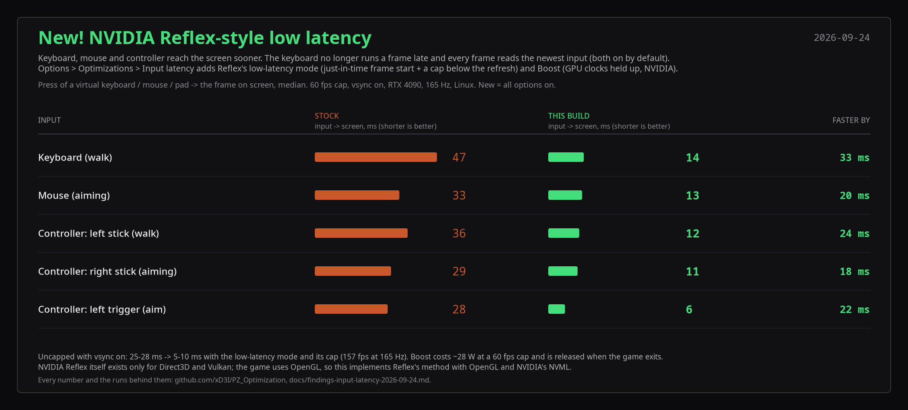
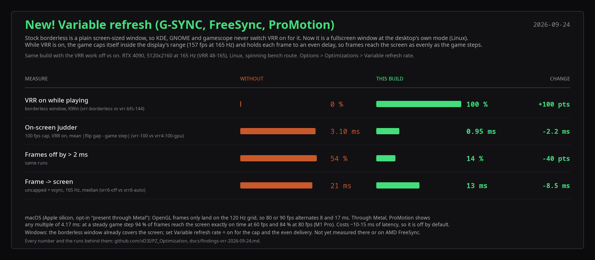
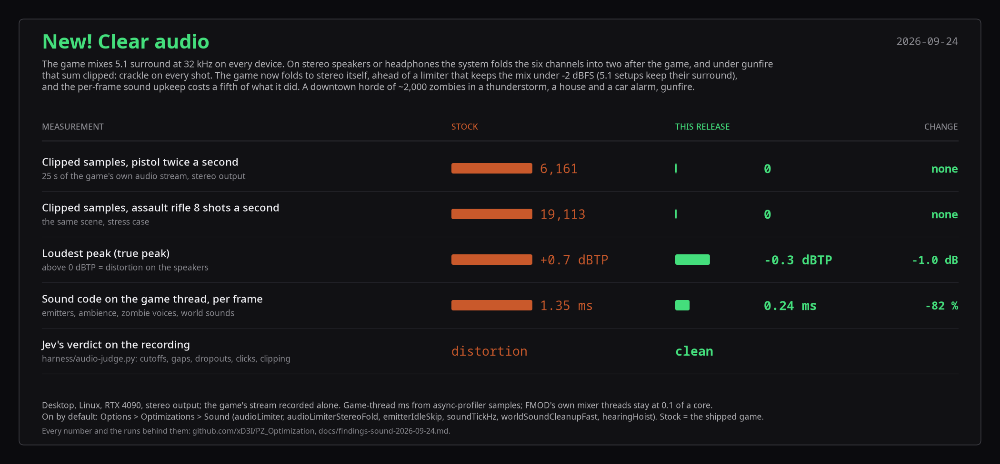

[](https://www.youtube.com/watch?v=GCjCYbTE9AQ)

# PZ_Optimization

Performance patches for **Project Zomboid Build 42**, on the Java side of the game.
Not a Lua mod: a set of drop-in `.class` files that shadow 41 game classes and remove
the worst stalls from the chunk streamer, the renderer, the weather and the loading path.
`projectzomboid.jar` is never modified, every change has a kill switch in an in-game
Options tab, and every number in this file comes from the hands-off benchmark harness in
this repo.

**Target: Build 42.20.4, jar revision `b0bbce05d5`, Windows, Linux and macOS** (the three
Steam depots ship the same jar). The overrides refuse to run against any other revision: they log one
line and the game behaves as stock.

| | |
|---|---|
| **Steam Workshop** | [PZ_Optimization (item 3805285544)](https://steamcommunity.com/sharedfiles/filedetails/?id=3805285544) |
| **Latest release** | [github.com/xD3I/PZ_Optimization/releases/latest](https://github.com/xD3I/PZ_Optimization/releases/latest) (`install.ps1`, `install.sh`, `pzopt-b0bbce05d5-classes.zip`) |
| **Showcase video** | [youtube.com/watch?v=GCjCYbTE9AQ](https://www.youtube.com/watch?v=GCjCYbTE9AQ), stock vs all optimizations ([See it in action](#see-it-in-action)) |
| **Live benchmark dashboard** | [pzo.diegov.dev](https://pzo.diegov.dev) (Grafana: every harness run since 2026-09-24 frame by frame, CPU / GPU use, profiler flame graphs, run-vs-run diffs, the game being benchmarked right now; the first page load after a quiet spell takes a few seconds) |
| **Every run, in order** | [`docs/results.md`](docs/results.md) (earlier runs: [`docs/archive/2026-09-24/`](docs/archive/2026-09-24/)) |

Single player is what has been measured. The files are client side only (nothing to
install on a server); read [Known limitations](#known-limitations) before installing on a
machine you play on.

> **Turn off Steam's in-game performance monitor** (Settings > In Game > "In-game
> performance monitor", the newer overlay, not the classic Shift+Tab one). It hooks every
> GL call and serialises the render thread: with it on the optimized game stops at about
> 160 fps and the headroom these patches recover is hidden (164 vs 237 fps on the 120 km/h
> route, `docs/archive/2026-09-24/results.md` 2026-09-19). Use the build's own overlay
> ([F9 / L3 + R3](#performance-overlay-f9--l3--r3)), MangoHud or RivaTuner instead.

---

## Contents

1. [See it in action](#see-it-in-action)
2. [Results at a glance](#results-at-a-glance)
   - [Weather: fog & lightning at 120 km/h](#weather-fog--lightning-at-120-kmh)
   - [Rosewood spin, uncapped](#rosewood-spin-uncapped)
   - [Downtown Louisville, 2,500 zombies](#downtown-louisville-2500-zombies)
   - [Boot and load](#boot-and-load)
   - [Windows](#windows)
   - [macOS](#macos)
   - [Handheld and old laptops](#handheld-and-old-laptops)
   - [Against the Workshop's performance mods](#against-the-workshops-performance-mods)
   - [Input latency: NVIDIA Reflex-style low latency](#input-latency-nvidia-reflex-style-low-latency)
   - [Variable refresh: G-SYNC, FreeSync, ProMotion](#variable-refresh-g-sync-freesync-promotion)
   - [Clear audio: no clipping under gunfire](#clear-audio-no-clipping-under-gunfire)
3. [Install](#install)
   - [Requirements](#requirements)
   - [Method A: Steam Workshop](#method-a-steam-workshop)
   - [Method B: installer script from the GitHub release](#method-b-installer-script-from-the-github-release)
   - [Method C: unpack the zip by hand](#method-c-unpack-the-zip-by-hand)
   - [Method D: build from source (Linux)](#method-d-build-from-source-linux)
   - [Check that it loaded](#check-that-it-loaded)
   - [Uninstall](#uninstall)
   - [Updating the mod](#updating-the-mod)
   - [After a game update](#after-a-game-update)
4. [Settings](#settings)
   - [Options > Optimizations](#options--optimizations)
   - [Frame cap: Uncapped, 300 to 500 fps, menu framerate](#frame-cap-uncapped-300-to-500-fps-menu-framerate)
   - [Upscaling: FSR 1.0 and DLSS](#upscaling-fsr-10-and-dlss)
   - [Performance overlay (F9 / L3 + R3)](#performance-overlay-f9--l3--r3)
   - [`pzopt.properties` and the key table](#pzoptproperties-and-the-key-table)
5. [How the optimizations work](#how-the-optimizations-work)
   - [Chunk streaming](#1-chunk-streaming)
   - [Renderer](#2-renderer)
   - [Weather: puddles, rain, lightning, fog](#3-weather-puddles-rain-lightning-fog)
   - [Boot: launch to main menu](#4-boot-launch-to-main-menu)
   - [Load: Continue to world ready](#5-load-continue-to-world-ready)
   - [Visual fixes found on the way](#6-visual-fixes-found-on-the-way)
   - [Measured and not adopted](#measured-and-not-adopted)
6. [How the install works without touching the jar](#how-the-install-works-without-touching-the-jar)
7. [Known limitations](#known-limitations)
8. [Roadmap](#roadmap)
9. [Benchmark harness](#benchmark-harness)
10. [Repository layout](#repository-layout)

---

## See it in action

**[Project Zomboid Build 42: stock vs all optimizations](https://www.youtube.com/watch?v=GCjCYbTE9AQ)**
(YouTube, 2 min, with sound). Same PC, same save, same routes: stock with every optimization
off and the frame cap removed on the left, the same build with the overrides on and uncapped
on the right. Six scenes in order: boot and load, the 120 km/h highway drive, the Options >
Optimizations tab, the spinning Rosewood route, heavy fog, a thunderstorm. The in-game
overlay shows the live frame time; the big number is the 1 s average from its log, the
results card at the end the whole-route numbers below.


*The last beat of the showcase as the Workshop preview (12 fps GIF): the optimized build at ~500 fps uncapped, the in-game overlay along the bottom.*

| Scene | Stock | Optimized | Change |
|---|---|---|---|
| Boot, launch to main menu | 7.3 s | 4.8 s | -34 % |
| Load, Continue to world ready | 7.5 s | 3.4 s | -55 % |
| 120 km/h highway drive, fps / p99 | 156 fps / 16.5 ms | 512 fps / 5.8 ms | +228 % / -65 % |
| Rosewood, spinning view, fps / p99 | 140 fps / 27.9 ms | 447 fps / 8.4 ms | +220 % / -70 % |
| 120 km/h drive, heavy fog, fps / p99 | 111 fps / 18.9 ms | 256 fps / 8.4 ms | +131 % / -56 % |
| 120 km/h drive, thunderstorm, fps / p99 | 70 fps / 67 ms | 392 fps / 9.9 ms | +460 % / -85 % |

Boot and load are the mean of four launches each; fps = presented frames per second over
the whole route, p99 = the frame time 99 % of frames stay under. Ryzen 7 9800X3D, RTX 4090,
32 GB DDR5-8000, CachyOS, native Linux build, NVIDIA OpenGL, 5120x2160 at 240 Hz, max zoom,
no frame cap on either side. Recorded 2026-09-21 with the build from the latest release.

---

## Results at a glance

Same machine and conditions as the video unless a section says otherwise. "Stock" is this
build with every optimization switched off (`enabled=false`), which reproduces the shipped
game exactly.

### Weather: fog & lightning at 120 km/h

The 1,200-tile drive in a thunderstorm with a lightning strike every 6 s, and the same drive in
a thunderstorm inside heavy fog (`--preset storm-fog`, six strikes). Heavy fog was the slowest
weather by far: stock draws it as one screen-wide rectangle per tile row and level, so every
pixel is shaded up to twelve times, one draw call per row; the fog pass (`fogPass`, on by
default) draws every row in one call into a quarter-size fog buffer and blends it over the
scene once. The storm side has the puddle cache in GPU buffers, the early-depth puddle
shaders, the rain tiles, the lightning re-bake spread and the tree copies
([Weather](#3-weather-puddles-rain-lightning-fog)). A thunderstorm with lightning now runs at
85 % of the clear-weather frame rate on this machine (392 vs 454–465 fps); before this pass it
was 232 vs 420. Runs `sbs2-storm120-stock-1` / `sbs2-storm120-opt-1` and `sbs-stormfog-stock` /
`sbs-stormfog-opt` (2026-09-21); videos (AV1 HDR)
`docs/media/drive-120kmh-storm-stock-vs-optimized-2026-09-21.mp4` and
`drive-120kmh-storm-fog-stock-vs-optimized-1080.mp4`; findings in
[`docs/archive/2026-09-24/findings-storm-parity-2026-09-21.md`](docs/archive/2026-09-24/findings-storm-parity-2026-09-21.md) and
[`docs/archive/2026-09-24/findings-fog-2026-09-21.md`](docs/archive/2026-09-24/findings-fog-2026-09-21.md).


| Metric | Lightning: stock | Lightning: optimized | Fog + lightning: stock | Fog + lightning: optimized |
|---|---|---|---|---|
| fps, mean | 70 | 392 | 60 | 191 |
| Frame time, mean / p50 | 14.2 / 13.3 ms | 2.6 / 2.0 ms | 16.6 / 15.4 ms | 5.2 / 4.1 ms |
| Frame time, p90 / p99 / p99.9 | 16.6 / 67 / 84 ms | 4.6 / 9.9 / 14.4 ms | 19.9 / 71.7 / 92.9 ms | 9.1 / 16.5 / 22.3 ms |
| Frames over 33 ms | 46 | 0 | 49 | 0 |
| GPU / game thread / render thread busy | 85 / 85 / 83 % | 98 / 68 / 45 % | | |

Stock is capped at 300 by the in-game limiter, moot at 60–70 fps; optimized is uncapped. Heavy
fog alone on the same route in clear weather: stock fog 220 fps, the fog pass 333–392 fps, no
fog 447 fps (the fog's own GPU time 1.52 → 0.35 ms a frame).

### Rosewood spin, uncapped

A 25 s teleport route south through Rosewood at max zoom with the player's facing spinning at
90°/s, so the view cone, lighting cone and wall cutaways change every frame while 55 chunks a
second stream in; the heaviest bench route. Three runs: stock, the build before the
uncapped pass of 2026-09-20 and the build with everything (runs `u400show-stock-2`,
`u400show-prev-1`, `u400show-all-1`).


| Metric | Stock | Optimized (before the pass) | All optimizations |
|---|---|---|---|
| fps, mean | 114 | 391 | 492 |
| Frame time, mean / p50 | 8.8 / 6.2 ms | 2.6 / 1.9 ms | 2.0 / 1.6 ms |
| Frame time, p90 / p99 / p99.9 | 17.8 / 31.4 / 53.1 ms | 4.4 / 10.2 / 20.0 ms | 3.3 / 7.7 / 15.8 ms |
| Frames below 240 fps | 71 % | 9 % | 4 % |

From about 450 fps the GPU is saturated (the chunk-texture composite and the bakes) with
the game thread at ~89 %, so both sides of the machine are used to the full at 5120x2160.
The frames still above 2.5 ms are chunk streaming on the game thread (loot roll, bakes and
cutaway data of freshly loaded chunks); what locking 400 needs is in the [Roadmap](#roadmap).
Two things learned on the way: the stock Display option **UI rendering: offscreen** is worth
about 40 % uncapped on this machine, and a `mangohud %command%` in the Steam launch options
costs about 30 % uncapped.

### Downtown Louisville, 2,500 zombies

`--preset louisville`: the spinning walk through downtown Louisville with the sandbox zombie
population at 4x, ~2,000 zombies loaded at the start and ~2,500 by the end
(runs `show-louisville-stock-3` / `show-louisville-opt-3`, 2026-09-20).

| Metric | Stock | Optimized |
|---|---|---|
| fps, mean | 23.7 | 31.7 |
| Frame time, p50 / p99 / p99.9 | 39.5 / 94.4 / 135.5 ms | 29.8 / 56.6 / 122.6 ms |
| Frames over 33 ms | 402 of 592 | 234 of 793 |
| GPU / game thread busy | 43 / 98 % | 42 / 98 % |

Both sides are bound by the zombie update on the game thread (character update, animation,
pathing), which no key touches yet; the +34 % and the halved p99 come from the render-side
keys.

### Boot and load

Bench save, `harness/loadtime.py`, best pair in the load loop
([`docs/plan-instant-load.md`](docs/plan-instant-load.md)). The first boot after installing
is slower: the animation-clip and texture-pack caches under `Zomboid/pzopt/` are written
then and read on every boot after.

| Phase | Stock | Optimized |
|---|---|---|
| Launch to main menu | 7.35 s | 5.00 s |
| Continue to world ready | 6.53 s | 4.03 s |

Chunk latency (ask to ready) on the 100 s drive went from 166 ms to 9 ms at the median and
from 1,024 ms to ~500 ms at p99 with the streamer changes alone; on the 60 km/h drive the
median is 4 to 5 ms.

### Windows

Windows 11, NVIDIA driver 616.92, fullscreen at desktop resolution, vsync off, launched
through Steam, zoom 2.5, 500 fps cap, two stock runs for the noise floor. Procedure and
boot timings: [`docs/windows-test.md`](docs/windows-test.md).

| Metric | Stock (best of 2) | Optimized | Change |
|---|---|---|---|
| fps, mean | 122 | 194 | 1.6x |
| Frame time, mean / p99 / p99.9 | 8.2 / 26.1 / 36.5 ms | 5.2 / 18.5 / 26.6 ms | -37 / -29 / -27 % |
| Frames over 33 ms | 30 | 8 | |
| Chunk queue wait, mean | 180 ms | 32 ms | 5.7x |
| GPU busy | 65 to 68 % | 52 % | |

Noise floor between the stock runs: 0.7 fps, 0.9 ms at p99. The optimized build is bound by
the game thread (93 % of wall). A Windows-only 0.5 s micro stutter reported by users was the
overlay's CPU-load sampling on the game thread; sampling is now opt-in and on a background
thread (2026-09-21).

### macOS

MacBook Pro with an Apple M1 Pro (8 CPU / 14 GPU cores, 16 GB), macOS 27, Apple's OpenGL over
Metal ("2.1 Metal - 91.7"), 1920x1200 fullscreen at 120 Hz, vsync off, 240 fps cap, zoom 2.5,
the 120 km/h highway drive (1,200 tiles east from the bench save), two runs per side, means
shown with the two values in brackets (2026-09-21; runs `mac-drive120-*`). Same files,
installed with `install.sh` into `Project Zomboid.app/Contents/Java`; stock is the same
install with `enabled=false`.

| Metric | Stock | Optimized | Change |
|---|---|---|---|
| fps, mean | 145 (143 / 147) | **203** (213 / 193) | 1.4x |
| Frame time, mean / p99 / p99.9 | 6.9 / 16.5 / 32.2 ms | 5.0 / 13.7 / 24.7 ms | -28 / -17 / -23 % |
| Frame time, max | 74.6 / 235.7 ms | 47.9 / 38.9 ms | |
| Frames over 33 ms / 50 ms | 7 + 3 / 3 + 2 | 1 + 2 / 0 | |
| Chunk queue wait, mean / median | 156 / 156 ms | 44 / 9 ms | 3.5x / 18x |
| GPU busy (`ioreg`) | 72 % | 77 % | |
| Game thread / render thread, of one core | 79 / 77 % | 86 / 65 % | |

Apple's GL has no `ARB_buffer_storage`, so `persistentVbo` falls back to the stock buffer path
by itself; everything else runs as on Linux. The optimized runs are neither at the cap nor
saturated (game thread 86 % of a core, GPU 77 %) and spread 10 % between themselves, so the
remaining tail is the next thing to look at there. The harness port is `harness/run-mac.sh`
(direct launch from the bundle's JRE, `top` + `ioreg` sampler).

### Handheld and old laptops

**AYANEO Flip 1S DS** (Ryzen AI 9 HX 370, Radeon 890M, 1920x1080, Linux, Mesa 26.2), on AC,
spinning Rosewood route, uncapped, one run per cell (2026-09-20):

| Profile | Build | fps, mean | Frame time, mean / p99 / p99.9 | Frames over 33 ms | Package power | fps / W |
|---|---|---|---|---|---|---|
| performance | stock | 56 | 17.8 / 39.3 / 57.5 ms | 24 | 37.7 W | 1.49 |
| performance | optimized | **126** | 8.0 / 22.4 / 33.2 ms | 4 | 40.5 W | 3.10 |
| power-saver | stock | 41 | 24.5 / 63.1 / 97.8 ms | 176 | 20.3 W | 2.01 |
| power-saver | optimized | **64** | 15.6 / 42.2 / 75.5 ms | 47 | 23.2 W | 2.77 |

2.2x on performance (balanced is the same run: the game thread is pegged at 99 % of one core
either way), 1.6x under the ~21 W power-saver cap; frames per watt double.

**Dell with an i5-6300HQ / GTX 960M** (4 cores, 1920x1080, Linux, NVIDIA 580; 2026-09-21).
Four cores change the trade-offs: the recalc pool's threads and the tree bakes both cost the
game thread more than they save, so the **Low-end hardware** profile in the Optimizations tab
(no pool, trees baked only while walking, lighting updates 10/s, UI redraw 30/s; see
[Settings](#settings)) plus the G1 launcher JSON is what these numbers use. Same routes as
above at max zoom, G1 collector on both sides, one run per cell:

| Route | Stock fps · mean · p99 | Low-end profile fps · mean · p99 |
|---|---|---|
| Walking through Rosewood, facing spinning | 49 · 20.5 ms · 69 ms | **81** · 12.3 ms · 30 ms |
| Drive at 60 km/h | 76 · 13.1 ms · 43 ms | **93** · 10.7 ms · 28 ms |
| Drive at 120 km/h | 44 · 22.8 ms · 80 ms | **68** · 14.6 ms · 40 ms |
| Drive at 120 km/h, **night, thunderstorm, heavy fog** | 15.4 · 64.8 ms · 202 ms | **31.4** · 31.8 ms · 101 ms |

The night storm in full fog (`--preset storm-fog --flag time_of_day=1`, six lightning strikes
on the route) doubles: 15.4 → 31.4 fps, p99 202 → 101 ms, the render thread from 41 % to
24 % of a core (the fog pass's single draw call, the rain tiles and the puddle cache), CPU the
game thread gets back on a box that is at 100 % throughout. World load 70 → 25 s. The stock
JSON's ZGC is not usable here (allocation stalls of up to 3 s once its concurrent threads lose
the four cores) and GraalVM 25.3 is 25–40 % behind HotSpot C2. Full pass in `docs/archive/2026-09-24/results.md`.

### Against the Workshop's performance mods

The most-subscribed Build 42 performance mods, each run on the same three routes (120 km/h
drive, the same drive in a thunderstorm, the Rosewood spin), uncapped, one mod at a time on
the stock game, checked in the console to be loaded and patching (2026-09-21; per-mod detail
in `docs/archive/2026-09-24/results.md`).


| Mod | Subscribers | What it is | Drive fps / p99 | Storm | Spin |
|---|---|---|---|---|---|
| Stock game | | | 167 / 15.5 ms | 75 / 59 | 135 / 27 |
| [Project Zomboid Optimiser](https://steamcommunity.com/sharedfiles/filedetails/?id=3787481250) | 23 k | Lua toggles, F10 control centre | 159 / 15.6 | 72 / 66 | 128 / 30 |
| … + its [PZO-Launcher](https://github.com/prop11/PZO-Launcher) engine jar and JVM flags | | agent jar, native lib, launcher JSON | 165 / 15.5 | 72 / 66 | 129 / 29 |
| [Tempo](https://steamcommunity.com/sharedfiles/filedetails/?id=3736629791) | 42 k | Lua sampler and menu memo | 160 / 15.3 | 71 / 61 | 130 / 28 |
| … + its optional class shadows | | chunk-finalize budget, 3D-zombie cap | 162 / 15.3 | 76 / 57 | 131 / 30 |
| [Multi-Cpu Enhance](https://steamcommunity.com/sharedfiles/filedetails/?id=3459875383) | 28 k | launcher JSON: ParallelGC, 8 GB heap | 169 / 15.2, **one 320 ms stall** | 74 / 62, **one 320 ms stall** | 136 / 29, **two 300–350 ms stalls** |
| [Every Texture Optimized](https://steamcommunity.com/sharedfiles/filedetails/?id=3119788162) | 616 k | 6,142 re-encoded textures | 163 / 15.2 | 72 / 63 | 135 / 29 |
| [Lugli – Optimizations](https://steamcommunity.com/sharedfiles/filedetails/?id=3790863696) | 3 k | ZombieBuddy patches | 162 / 15.3 | 73 / 60 | 135 / 28 |
| [Zed's Better FPS](https://steamcommunity.com/sharedfiles/filedetails/?id=3622986450) ([42.20 fix](https://steamcommunity.com/sharedfiles/filedetails/?id=3782613536)) | 47 k | ZombieBuddy patches: GL state cache, sprite batching | 161 / 15.2 | 75 / 59 | 134 / 28 |
| [Let Me Drive!](https://steamcommunity.com/sharedfiles/filedetails/?id=3805307651) | new (posted 2026-09-20) | Lua event gate: other mods' chunk handlers deferred, GC-call block, optional zoom cap / speed limit | 154 / 15.9 | 69 / 60 | — (drive only; fog 111 / 18.2 vs stock 114 / 17.7, storm + fog 63 / 64 vs 66 / 66) |
| **PZ_Optimization** | | class overrides | **481 / 8.8** | **246 / 13.8** | **456 / 8.5** |

Every one of them measures within run-to-run noise of the stock game (fps ±4 %, p99 ±3 ms):
none touches the per-frame chunk, tree and translucent drawing on the render thread or the
world update on the game thread that set the frame time. Multi-Cpu Enhance's
`-XX:+UseParallelGC` is worse than stock: a 300–350 ms stop-the-world collection landed inside
every route (the game's own G1 never paused longer than 21 ms).

### Input latency: NVIDIA Reflex-style low latency



Measured end to end: a virtual keyboard, mouse and Xbox pad (uinput) press, the game's own stage stamps, and the flip
that put the frame on screen (X Present). Stock reads the keyboard one frame late (`GameKeyboard` used the previous
poll), and every frame used input polled right after the previous frame was shown, however long the frame limiter then
idled. Two fixes are on by default: **fresh keyboard** (`keyboardFresh`) and **input latch** (`inputLatch`: the game asks
the render thread for a fresh poll the moment its frame starts). Three are options in Options > Optimizations > Input
latency:

- **Low-latency mode** (`reflexSleep` + `reflexCapFps=-1`): what NVIDIA Reflex does. Each frame measures how long it
  queued on the way to the screen (the hand-off to the render thread, a vsync swap that blocks, the driver's queue from
  GL timestamps) and the next one starts that much later; with vsync the frame rate is capped just below the refresh
  (refresh - refresh²/3600, 157 fps at 165 Hz) so the game can never refill the queue. Vsync on, uncapped:
  25-28 ms -> 5-10 ms input -> screen.
- **Boost** (`reflexBoost`, NVIDIA): at a frame cap the GPU idles and clocks down, so the frame it draws takes longer
  (3.9 ms per frame at 60 fps vs 1.3 ms at 240 on an RTX 4090). This holds the driver's "prefer maximum performance"
  through NVML while a world is loaded, as Reflex's On + Boost does; the driver drops it when the game exits. ~28 W more
  at a 60 fps cap.
- **Cursor latch**, **aim hold** and the other measured options (`cursorLatch`, `aimHoldMs`, `gpuMaxFrames`,
  `vsyncAdaptive`, `vblankLock`) are described in the tab.

NVIDIA Reflex itself is an SDK for Direct3D and Vulkan; there is none for OpenGL, which the game uses, so these are
Reflex's methods rebuilt with OpenGL and NVML. Every run and the techniques that did not help (the driver's
`__GL_MaxFramesAllowed`, adaptive vsync, a vblank-locked start under XWayland):
[docs/archive/2026-09-24/findings-input-latency-2026-09-24.md](docs/archive/2026-09-24/findings-input-latency-2026-09-24.md).

### Variable refresh: G-SYNC, FreeSync, ProMotion



A variable refresh display shows each frame the moment it is ready, so it only helps when the compositor turns it on and
the frames arrive evenly. Measured with the flip times of every frame (X Present), the kernel's `VRR_ENABLED` state and
the game's own per-frame stamps (`harness/pacing.py`):

- **Borderless gets VRR** (`borderlessFullscreen`, Linux, on by default): KDE, GNOME and gamescope enable VRR only for a
  window in the fullscreen state, and the stock borderless window is a screen-sized plain window, so it never got VRR
  (0 % of the run). It is now a fullscreen window at the desktop's own mode: no mode switch, it stays up when focus
  moves away, and the options still say borderless. VRR on for the whole run under XWayland and native Wayland.
- **Cap inside the range** (`vrr=auto`, `vrrCap`): while the kernel reports VRR on, an uncapped or too-high cap becomes
  refresh - refresh²/3600 (157 fps at 165 Hz), so frames never fall back to vsync at the ceiling: 21 -> 13 ms from the
  game's step to the screen.
- **Even delivery** (`presentPacing=auto`): the game steps at an even rate, but each frame takes a different time to
  update and draw, and with VRR that difference is on screen. Each swap is held to a high percentile of the recent
  step -> GPU-done time (GL timestamp queries, never blocking): on-screen judder 3.10 -> 0.95 ms at a 100 fps cap.
- **macOS ProMotion** (`macPresent`, Apple silicon, off by default): OpenGL frames are shown on the 120 Hz grid, so a
  90 fps cap alternates 8 and 17 ms. Presenting through Metal (`presentDrawable:afterMinimumDuration:` from a native
  fullscreen Space, the game's frame upscaled into a native-size drawable) shows any multiple of 4.17 ms: 94 % of
  steady frames exactly on their slot at 60 fps, 84 % at 80 (M1 Pro). It adds ~10-15 ms of latency, hence opt-in.

Windows (borderless already covers the screen there) and AMD FreeSync are not measured yet; on Windows set Variable
refresh rate = on in Options > Optimizations. Every run: [docs/archive/2026-09-24/findings-vrr-2026-09-24.md](docs/archive/2026-09-24/findings-vrr-2026-09-24.md).

### Clear audio: no clipping under gunfire



Measured on the game's own audio stream (PipeWire, recorded alone) in the loudest scene we could build: the downtown
Louisville horde (~2,000 zombies) in a thunderstorm with a house alarm, a car alarm, the helicopter and a pistol fired
twice a second; `harness/audio-judge.py` looks for cutoffs, gaps, dropouts, clicks and clipping and Jev gives the verdict.

- **No more crackle on stereo** (`audioLimiter`, `audioLimiterStereoFold`, on by default): the game mixes 5.1 surround at
  32 kHz on every device (fixed inside FMOD's init in the game's native library). On stereo speakers or headphones the
  operating system adds the six channels into two after the game, and under gunfire that sum clipped: 6,161 samples at
  full scale in 25 s with the pistol, 19,113 with an assault rifle at 8 shots a second, although FMOD's own output never
  passed 0.75. The game now folds to stereo itself, ahead of FMOD's limiter at the head of the master mix (ceiling
  -2 dBFS, 50 ms release): 0 clipped samples, true peak -0.3 dBTP. A 5.1 / 7.1 device keeps its surround and gets the
  limiter per channel.
- **Sound upkeep costs a fifth** (`emitterIdleSkip`, `soundTickHz`, `worldSoundCleanupFast`, `hearingHoist`): stock
  checks every zombie's three sound emitters every frame, refreshes the listener's ambience parameters every frame
  (FMOD applies them every 20 ms), sweeps every chunk's expired noises one `remove` at a time and re-reads a zombie's
  hearing per candidate sound. Silent zombies now skip their emitters, the ambience runs at 60 Hz, the sweep only runs
  when a noise expired, and hearing is read once: sound code on the game thread 1.35 ms -> 0.24 ms a frame. FMOD's own
  threads stay at 0.1 of a core.

All of them are in Options > Optimizations > Sound. Every run: [docs/findings-sound-2026-09-24.md](docs/findings-sound-2026-09-24.md).

---

## Install

Four ways to get the same files into the game folder. A and B are the ones to use; C is
for offline or hand installs; D is for changing the code. The game reads the files at start,
so **close the game first** whichever method you pick.

### Requirements

- Project Zomboid on Steam on the **Build 42.20.4** beta (right-click the game, Properties,
  Betas). The Windows, Linux and macOS depots all work; the jar is the same.
- Windows: Windows PowerShell 5.1 or newer (built in). Linux and macOS: `bash`, `curl` or
  the `gh` CLI, and `unzip` (or `python3`); a stock Mac has all of them, no Xcode or Homebrew
  needed. No JDK anywhere.
- Nothing is compiled; nothing is written outside the game folder and `Zomboid/pzopt/`.

Every installer below does the same thing: locate the game through Steam's library list
(or `-Dir` / `--dir <folder>` / `PZ_DIR`), read the game revision from the jar, check that
the launcher classpath loads loose classes and that no file it would write already exists,
copy the classes next to `projectzomboid.jar` (on macOS that is
`Project Zomboid.app/Contents/Java`), and record every file in
`pzopt-installed.txt` so the uninstall is exact. The jar is never touched.

### Method A: Steam Workshop

Subscribe to [PZ_Optimization on the Workshop](https://steamcommunity.com/sharedfiles/filedetails/?id=3805285544)
and let Steam download it. **Enabling it in the game's Mods list does nothing**: the
Workshop cannot write into the game folder, so the item only carries the files and the
installer, and one command finishes the install. Close the game, then:

**Windows** (PowerShell; adjust the drive if your Steam library is elsewhere):

```powershell
powershell -ExecutionPolicy Bypass -File "C:\Program Files (x86)\Steam\steamapps\workshop\content\108600\3805285544\mods\PZ_Optimization\42\install.ps1"
```

**Linux:**

```sh
bash ~/.local/share/Steam/steamapps/workshop/content/108600/3805285544/mods/PZ_Optimization/42/install.bash
```

**macOS** (Terminal):

```sh
bash ~/Library/Application\ Support/Steam/steamapps/workshop/content/108600/3805285544/mods/PZ_Optimization/42/install.bash
```

The script finds the unpacked `pzopt-classes/` folder next to itself and installs from it,
no download. Updates arrive through the Workshop; run the same command again after an update
(`-Uninstall` / `--uninstall` first if the status says a file changed). Item layout and
upload procedure: [`docs/workshop.md`](docs/workshop.md).

### Method B: installer script from the GitHub release

The script downloads `pzopt-<revision>-classes.zip` for your game's revision from the
matching release and installs it.

**Windows** (Start menu, type `powershell`):

```powershell
Invoke-WebRequest https://github.com/xD3I/PZ_Optimization/releases/latest/download/install.ps1 -OutFile "$env:USERPROFILE\Downloads\install.ps1"
powershell -ExecutionPolicy Bypass -File "$env:USERPROFILE\Downloads\install.ps1"
```

**Linux and macOS** (Terminal):

```sh
curl -fsSLO https://github.com/xD3I/PZ_Optimization/releases/latest/download/install.sh
chmod +x install.sh
./install.sh
```

On macOS the script finds `Project Zomboid.app` through Steam's library list and installs
into its `Contents/Java`; the bundle's launcher already searches that folder before the jar,
so nothing in the app is edited.

Both scripts take the same options: `-Status` / `--status` (installed for which revision,
any `MISSING` / `MODIFIED` file, the contents of `pzopt.properties` if present),
`-Uninstall` / `--uninstall`, `-Dir` / `--dir <game folder>`, `-Zip` / `--zip <file>` to
install a zip you already have, `-From` / `--from <folder>` to install an unpacked tree.

### Method C: unpack the zip by hand

Download `pzopt-b0bbce05d5-classes.zip` (about 850 KB) from the
[release page](https://github.com/xD3I/PZ_Optimization/releases/latest) and unpack it into
the folder that holds `projectzomboid.jar`, without overwriting anything (`Expand-Archive`
without `-Force`, or `unzip -n`). On macOS that folder is inside the app bundle: in
`~/Library/Application Support/Steam/steamapps/common/ProjectZomboid`, right-click
`Project Zomboid.app`, Show Package Contents, `Contents/Java`. The zip carries `pzopt-files.txt`, the list of everything
it adds. The revision in the file name must match your game (42.20.4 is `b0bbce05d5`); a
zip for another revision disables itself at start-up. To remove it, delete the files listed
in `pzopt-files.txt` and the empty folders they leave, or run either installer's uninstall.

### Method D: build from source (Linux)

For changing the code. Needs a JDK 25 or newer (`javac`, `javap`), Python 3, `git`, `bash`.

```sh
sudo pacman -S jdk-openjdk            # Arch / CachyOS
sudo apt install openjdk-25-jdk       # Debian / Ubuntu (or the newest available)
sudo dnf install java-latest-openjdk-devel   # Fedora

git clone https://github.com/xD3I/PZ_Optimization.git
cd PZ_Optimization
scripts/build.sh          # compiles src/ against your jar, checks the stock class signatures
scripts/pzopt.sh install  # copies build/classes/ in, records pzopt-installed.txt
scripts/pzopt.sh status   # must say installed: yes, no MISSING / MODIFIED
```

If the game is not in `/games/steamapps/common/ProjectZomboid`, export `PZ_ROOT` first
(the folder that contains `projectzomboid/` with the jar and `ProjectZomboid64.json`):
`export PZ_ROOT="$HOME/.local/share/Steam/steamapps/common/ProjectZomboid"`. `build.sh` ends
with `built N class files into build/classes for game revision b0bbce05d5` and fails
loudly on a revision or signature mismatch. `scripts/test.sh` runs the JVM-only unit tests
(no game needed); `scripts/release.sh` builds the release zip. `scripts/pzopt.sh` and
`install.sh` read the same manifest, so either can uninstall what the other installed.

On Windows the repository is not needed to play; if you clone it, use a short path
(`C:\Users\<you>\PZ_Optimization`, some files sit ten folders deep) and the build scripts
do not run there.

### Check that it loaded

Start the game from Steam as usual. The first boot is slower (caches are written under
`Zomboid/pzopt/`). Once at the main menu, `Zomboid/console.txt` (Windows
`%USERPROFILE%\Zomboid`, Linux and macOS `~/Zomboid`) shows one `[pzopt] loaded override ... active`
line per class in its first seconds:

```powershell
Select-String -Path "$env:USERPROFILE\Zomboid\console.txt" -Pattern "\[pzopt\] loaded override" | Measure-Object | Select-Object -ExpandProperty Count
```

```sh
grep -c '\[pzopt\] loaded override' ~/Zomboid/console.txt
```

| You see | Meaning |
|---|---|
| dozens of lines | the overrides are active. Options has an **Optimizations** tab and Display has the **Uncapped** entry. Done. |
| `0` | the class files did not load. Check that `<game>\pzopt\Overrides.class` exists and that `ProjectZomboid64.json` lists `"."` before `"projectzomboid.jar"` under `classpath` (it does on the stock depot; the macOS bundle has no JSON, its launcher puts `Contents/Java` first by itself). |
| a line saying the overrides were built for another revision | your game is not 42.20.4 / `b0bbce05d5`; the game runs as stock. Switch Steam to that beta or wait for a matching release. |

### Uninstall

Close the game. The jar was never modified, so no Steam file verification is needed.

```powershell
powershell -ExecutionPolicy Bypass -File .\install.ps1 -Uninstall      # Windows (release or Workshop copy of the script)
```

```sh
./install.sh --uninstall        # Linux / macOS, release or Workshop install
scripts/pzopt.sh uninstall      # Linux, from-source install
```

Each removes exactly the files it recorded and the empty folders they leave. The caches and
settings under `Zomboid/pzopt/` (`options.ini`, `framecap.ini`, `anims/`, `packs/`) can be
deleted by hand; without the overrides the game uses whatever its own `options.ini` holds.

### Updating the mod

Once installed by either script (Workshop copy or release download), the game updates it
by itself: the main menu has an **UPDATE PZ OPTIMIZATION** item between CREDITS and QUIT,
styled like the stock ones, greyed out while your build is current. Once per boot the menu
checks the GitHub releases and, when a newer build for your game revision exists, the item
lights up. It opens a dialog with the installed and offered builds and
the release notes; **Update now** downloads the zip, replaces the files listed in
`pzopt-installed.txt` (the game's own files are never touched, saves and options stay) and
asks to quit, because the classes already loaded stay the old ones until the next launch.
With a controller the lit item is one more row of the menu's D-pad list (A opens the dialog;
there A is the first button, B the second one or close, the D-pad scrolls the notes).
Nothing is downloaded before that click; the check itself is one request to
`api.github.com` and can be switched off in Options > Optimizations > Updates
(`updateCheck=false`). A copy unpacked by hand (Method C, no `pzopt-installed.txt`) only
gets a link to the release page from the item.

### After a game update

The classes are compiled against one exact jar. After Steam updates the game they disable
themselves (one log line, stock behaviour). Uninstall them and wait for a release whose zip
carries the new revision, then install again; the Workshop item is updated at the same
time. From source, on an unchanged revision (a Steam re-verify, for example) just
`scripts/pzopt.sh uninstall && scripts/build.sh && scripts/pzopt.sh install`; if
`build.sh` reports a mismatch the game changed and the overrides need porting
(`scripts/regen-overrides.sh`, `.claude/skills/game-update`).

---

## Settings

Nothing needs configuring: the defaults are what every number above was measured with.
Three places change them, in order of precedence: `pzopt.properties` in the game folder
(or `-Dpzopt.<key>=` JVM properties) wins over the Options tab, which wins over the built-in
default. A key set to `false` or `0` restores stock behaviour for that item alone.

### Options > Optimizations

Every optimization is a control in **Options > Optimizations**, a tab right after Display &
Performance. At the top is the master switch with two buttons: **Disable all (stock game)**
unticks it, and after the next launch the game runs its original code everywhere, as if
nothing were installed (the tab's heading reads "since this boot: OFF"); **Enable all
(recommended defaults)** ticks it again and puts every setting back to the build's defaults.
A third button, **Low-end hardware (4 cores or less)**, is the set measured on a 4-core Core
i5-6300HQ with a GTX 960M (2026-09-21, `docs/archive/2026-09-24/results.md`): no chunk worker pool, trees baked
into chunk textures only while walking (`treeBakeMaxChunksPerSec`: while driving a chunk
texture lives seconds and baking its trees cost more than drawing them), and on the Display
page lighting updates 10/s and the UI redrawn 30/s — 120 km/h drive 44 → 68 fps, walking
49 → 81, p99 halved. On such a machine also use the G1 launcher JSON
(`config/launcher/ProjectZomboid64.g1.json`): the stock ZGC stalls the game for seconds on
four cores. A fourth button, **Low-end hardware + FSR 1.0 upscaling**, is that same set plus
`upscaler=fsr1` at Quality (67 % per axis): on the same laptop the clear routes are CPU-bound, so
the upscaler is free but idle there, while the night thunderstorm in heavy fog goes from p99 145 ms
to 111 and the GPU load from 48 % to 40 % (2026-09-22, `docs/archive/2026-09-24/results.md`); a machine whose GPU is
the wall gains roughly the pixel ratio.
Below come titled groups: chunk textures (what bakes, bake budgets), cutaways / lighting /
weather, sprite buffers, multiplayer, performance overlay (one dropdown per overlay element:
statistics, game-thread tree, verdict, frame graph, flame graph, plus the sampler rate and the
fps-colour thresholds), chunk streaming, boot (threads and caches, parsers), world load (file
system and decoding, loading screen). Tick boxes are on/off switches; combos hold the numeric
budgets, thread counts and element sizes, with the default on your machine as the first entry. Hover a control for what it does and its key name. Changes
apply on the next launch (the game shows its usual restart dialog) and are kept in
`Zomboid/pzopt/options.ini`; "Default" removes the key again. A key pinned in
`pzopt.properties` shows as a disabled control whose tooltip names the file.

Right of the list, a preview panel that fills the rest of the screen follows the mouse (its parts keep
their places from row to row): for the setting you point at it plays
the **stock game and the optimized build side by side** on the same route (short clips of
the harness recordings — the 120 km/h drive, the Rosewood spin, fog, a thunderstorm, the
Louisville horde, night with a torch or headlights, and launch-to-world for the boot and load
settings — with each run's live frame rate burned in; the performance-overlay settings show the overlay off
and on, each element cropped from the same recording), repeats what the setting does, shows
its value since this boot and at the next launch, and draws one bar per resource: **CPU game
thread, CPU render thread, other cores, GPU, VRAM, RAM, disk / caches, boot and load time,
chunk arrival**, on a labelled axis from *lowest* through *mid* (the stock game) to *max*. Green bars
grow left for less load (or a shorter load, chunks sooner), amber right for more, blue for idle
cores put to work; the level word next to each bar says the same. The clips are 512 px, 24 fps GIFs under
`media/ui/pzopt/compare/`, decoded in the game and freed when the options screen closes.


To compare against stock on your own machine, press **Disable all**, or put `enabled=false`
in `pzopt.properties`; no reinstall is needed either way.

### Frame cap: Uncapped, 300 to 500 fps, menu framerate

Display & Performance keeps the stock layout and gains a real **Uncapped** entry, 300, 330,
400, 430 and 500 fps caps, and a separate **Menu framerate** combo (`pzopt.FrameCap`,
setting stored in `Zomboid/pzopt/framecap.ini`, so the choice survives the game's own
rewrite of `options.ini`). The stock Display option **UI rendering: offscreen** is worth
about 40 % uncapped on the desktop.


### Upscaling: FSR 1.0 and DLSS

Options > Optimizations > **Upscaling** renders the world at a fraction of the screen size and
scales it back up before the UI, the world text, the cursor and the game's own screen shader, which
stay at full resolution (keys `upscaler`, `upscalerQuality`, `upscalerScalePct`, `fsrSharpnessPct`,
`dlssPreset`, `upscalerObjectMv`; off by default, applied on the next launch).

**How it works.** The game draws the whole world (chunk textures, characters, vehicles, weather,
lighting) into an offscreen frame and then draws the interface over it. With an upscaler on, that
world frame is rendered into a smaller viewport of the same buffer, a fraction of the screen per
axis (`quality` 67 %, `balanced` 58 %, `performance` 50 % = a quarter of the pixels, `ultra` 33 %),
and resolved back to the screen size right before the game's own screen shader runs, so the UI,
the world text, the cursor, the map and the screen effects keep every pixel. Nothing changes on the
game thread: culling, chunk loading, mouse picking and the chunk-texture bakes are the same as
before. `fsr1` rebuilds the edges (EASU) and re-sharpens (RCAS) in ~0.1 ms at 4K on any GPU; `dlss`
draws the world with a sub-pixel jitter and feeds the camera's and each character's and vehicle's
motion to NVIDIA's network, which accumulates detail across frames (1-px power lines and car
lettering come back at 50 %); `bicubic` is the plain stretch the stock screen shader already does.

**Turning it on.** Options > Optimizations > Upscaling: set **Upscaler** to `fsr1` (or `dlss` on an
RTX card once the shim is under `natives/`, see "Enabling DLSS" below), pick **Upscaler quality** (`quality` keeps most of the
detail, `performance` halves both axes), optionally an explicit percentage, the FSR sharpening
and the DLSS preset, then restart the game — the tab shows the stock "restart required" dialog.
`console.txt` confirms it with one line, `[pzopt] upscaler: fsr1 at 50 % (performance)`; a mode
that cannot run says why and continues as `fsr1` (`upscaler: dlss unavailable (...)`). The same
keys work as `-Dpzopt.upscaler=fsr1` or in `pzopt.properties`.

**When it helps.** Whenever the GPU is the limit: the overlay's (F9 / L3 + R3) verdict line reads `GPU bound`
(GPU busy ≥ 90 %) and the frame rate is under the cap. That is the usual state at 4K and 5K, on
laptops and integrated GPUs, in heavy fog and thunderstorms, and in downtown Louisville, where the
world pass is most of the GPU's frame; the gain is roughly the pixel ratio of that pass (this 4090
at 5120x2160: 509 → 619 fps at 50 %, and the spinning Rosewood walk 592 → 802). It does nothing
when the verdict says `game thread bound` (a horde, chunk streaming, the zombie simulation) or
`at the cap`, and DLSS's own cost is per output pixel (~2.5 ms a frame at 5120x2160 on a 4090),
so at 4K and above prefer `fsr1` or `dlssPreset=f`; DLSS pays off at 1440p and below, or whenever
its reconstructed detail matters more than the frame rate.

**Enabling DLSS (Linux, RTX).** The release zip and the Workshop item carry no native libraries,
so `upscaler=dlss` on a fresh install logs `upscaler: dlss unavailable (dlss: .../natives/libpzopt_ngx64.so
not found); using fsr1 at 50 %` and runs as FSR 1.0. DLSS needs two files under the game's `natives/`
folder (next to `libLighting64.so`): the shim `libpzopt_ngx64.so`, built from `src/native/pzopt_ngx.cpp`
against NVIDIA's DLSS SDK, and NVIDIA's DLSS library `libnvidia-ngx-dlss.so.<version>` from that SDK.

The easy way: **Options > Optimizations > Install DLSS files**. The button checks what your machine has, downloads
the shim from this project's `dlss-linux-*` release and NVIDIA's DLSS library straight from NVIDIA's DLSS repository
(never re-hosted here), checks both against their pinned sha256 and puts them in `natives/`; then pick Upscaler: dlss
and restart the game. It needs an RTX card: on Linux x86-64 the proprietary NVIDIA driver and the Vulkan loader, on
Windows x86-64 the NVIDIA driver (the Windows shim is built with MSVC, `docs/dlss-windows-build.md`; until a
`dlss-windows-*` release exists the button reports that no release carries it); on macOS it says there is no DLSS. The files survive the
in-game updates; removing them by hand (`natives/libpzopt_ngx64.so`, `natives/libnvidia-ngx-dlss.so.*`,
`natives/pzopt-dlss-installed.txt`) is safe.

Or build both yourself, on top of any install method (Workshop, installer, zip); it takes a minute:

1. Requirements: an RTX card on the proprietary NVIDIA driver (it ships `libnvidia-ngx.so.1`: Arch
   `nvidia-utils`, elsewhere the `nvidia-driver-<version>` packages; check with
   `ls /usr/lib*/libnvidia-ngx.so.1 /usr/lib/x86_64-linux-gnu/libnvidia-ngx.so.1`), the game running on
   that driver's OpenGL (the default; not Mesa / Zink), `g++`, `git`, the Vulkan loader and headers.
   ```sh
   sudo pacman -S gcc git vulkan-headers vulkan-icd-loader     # Arch / CachyOS
   sudo apt install g++ git libvulkan-dev                       # Debian / Ubuntu
   sudo dnf install gcc-c++ git vulkan-headers vulkan-loader-devel   # Fedora
   ```
2. Get NVIDIA's DLSS SDK (public on GitHub, under NVIDIA's SDK license; ~600 MB) and the repository:
   ```sh
   git clone --depth 1 https://github.com/NVIDIA/DLSS ~/.local/share/nvidia-dlss-sdk
   git clone --depth 1 https://github.com/xD3I/PZ_Optimization.git
   ```
3. Build the shim and copy it, with the DLSS library, into the game's `natives/` folder
   (`PZ` below is the folder that holds `projectzomboid.jar`; on this machine
   `/games/steamapps/common/ProjectZomboid/projectzomboid`, usually
   `~/.local/share/Steam/steamapps/common/ProjectZomboid/projectzomboid`):
   ```sh
   SDK=~/.local/share/nvidia-dlss-sdk
   PZ=~/.local/share/Steam/steamapps/common/ProjectZomboid/projectzomboid
   cd PZ_Optimization
   g++ -O2 -shared -fPIC -std=c++17 -fvisibility=hidden -I$SDK/include -o "$PZ/natives/libpzopt_ngx64.so" \
       src/native/pzopt_ngx.cpp $SDK/lib/Linux_x86_64/libnvsdk_ngx.a -ldl -lpthread
   cp $SDK/lib/Linux_x86_64/rel/libnvidia-ngx-dlss.so.* "$PZ/natives/"
   ```
   (Deprecation warnings from the SDK headers are normal.) With a source build, `scripts/build.sh` does
   the same when the SDK checkout is at that path — `PZOPT_DLSS_SDK=<dir>` names another one,
   `PZOPT_DLSS=0` skips it — and `scripts/pzopt.sh install` copies both files in with the classes.
4. Options > Optimizations > Upscaling: **Upscaler** = `dlss`, a quality (`performance` = 50 %, or
   `native` for DLAA anti-aliasing at full size), optionally a **DLSS model preset** ("Upscaler, NVIDIA DLSS: model preset") (`f` is the
   cheap one at 4K), restart the game. `console.txt` then has `[pzopt] upscaler: dlss at 50 % (performance)`
   followed a few frames later by `[pzopt] dlss: ready, 2560x1080 -> 5120x2160 (performance, preset default,
   ...)`. If it says `upscaler: dlss unavailable (...)` instead, the reason is in the parentheses: the
   shim or the library not under `natives/`, no NVIDIA Vulkan device, a driver without
   `GL_EXT_memory_object_fd` / `GL_EXT_semaphore_fd` (Mesa / Zink, or an old driver), or NGX refusing the
   card; the game keeps running with FSR 1.0 at the same scale.

The two hand-copied files are not in `pzopt-installed.txt`, so an uninstall leaves them behind: delete
`natives/libpzopt_ngx64.so` and `natives/libnvidia-ngx-dlss.so.*` by hand (the game does not touch them
without the overrides). NGX writes its own cache under `Zomboid/pzopt/ngx/`. Split screen falls back to
FSR 1.0 (one DLSS feature per screen). Windows: the same shim needs an MSVC build (`src/native/README.md`);
until someone builds and tests that DLL, `upscaler=dlss` on Windows runs as FSR 1.0.

| `upscaler` | What runs | Where |
|---|---|---|
| `fsr1` | AMD FidelityFX Super Resolution 1.0 (EASU + RCAS, MIT) as GLSL passes on the low-res frame | every GPU, Linux / Windows / macOS |
| `dlss` | NVIDIA DLSS Super Resolution: a Vulkan device runs NGX on the GPU the game's GL context uses, sharing the colour / depth / motion-vector images and the output through `GL_EXT_memory_object` + `GL_EXT_semaphore`; the world is drawn with a sub-pixel jitter (a float viewport offset), the camera's motion and each character's and vehicle's own motion (stencil ids) go in as motion vectors | RTX cards on the NVIDIA driver; Linux now, Windows once the shim DLL is built with MSVC (`src/native/README.md`). The release zip and the Workshop item ship no natives (2026-09-22: 58 MB of NVIDIA's library, Windows cannot use the .so, the Workshop bans the extension): build the shim yourself, see "Enabling DLSS" above; anything that cannot run continues as `fsr1` |
| `bicubic` | the stock screen shader's bicubic filter stretches the low-res frame | every GPU (the plain baseline) |
| `xess` | Intel XeSS: not written yet (Windows-only SDK); runs as `fsr1` | – |

`upscalerQuality`: quality 67 % per axis, balanced 58 %, performance 50 %, ultra 33 %, native 100 %
(dlss: DLAA). The 120 km/h drive at 5120x2160, uncapped, one build (runs `ups-*-p-3/4`, `ups-dlss-f-1`,
2026-09-22):

| Mode | fps, mean | Frame time p50 / p99 | Notes |
|---|---|---|---|
| off | 509 | 1.5 / 7.7 ms | the GPU is the wall (96-98 % busy) |
| bicubic 50 % | 676 | 1.1 / 6.2 ms | soft |
| fsr1 50 % | 619 | 1.2 / 6.4 ms | EASU + RCAS ≈ 0.14 ms a frame at 4K |
| dlss 50 %, transformer (default) | 232 | 3.7 / 12.2 ms | the DLSS 4 model costs ~2.5 ms a frame at 5120x2160 output on a 4090; the best image (1-px power lines and car lettering come back) |
| dlss 50 %, `dlssPreset=f` (convolutional) | 377 | 2.2 / 9.2 ms | a third of the cost at 1440p and below |

The visual-parity watch (recorded pairs against an `upscaler=off` twin, `harness/parity-judge.py` +
`colorshift.py`) passed all four: a steady softening at 50 % and nothing that flickers, ghosts or
shifts colour; the DLSS pair on the spinning bench route (zombies, spinning player) had transients at
0.98x the control. The GPU stays saturated at 50 %: the chunk bakes and the composite are not
screen-pixel work, so the gain is the world pass's share. Plan and seam: `docs/plan-upscalers.md`.

### Performance overlay (F9 / L3 + R3)

Tick **"Sample frame times and utilization"** in **Options > Profiler** (a tab of its own right
after Optimizations, with the same preview panel and search; **Reset to defaults** puts its
settings back; every setting on it applies when you press Apply, no restart), then press **F9** (key binding "Toggle performance overlay", after "Display FPS") or, on a
controller, **L3 + R3** (both sticks pressed together).
Sampling is off by default (F9 / L3 + R3 then only shows a notice pointing at the tick box): it is the
build's own profiler, drawn by the game itself, so it reads the same on Windows and Linux,
in the menus, on the loading screen and in the world, with no MangoHud or RivaTuner.


- **Frames**: fps, mean frame time and the active cap; p50 / p99 / p99.9 / max over the last
  5 s; 1 %-low fps, frame-to-frame jitter and the number of spikes above twice the median.
  The fps number is coloured against the cap (blue at the cap, green within 10 %, yellow
  within 50 %, red below; uncapped: blue above 300, green 150–300, yellow 100–150, red under
  100); the "fps colour" group in the Profiler tab changes the thresholds and colours or turns it off.
- **Utilization**: GPU busy share (a GL timer query around the frame's draw commands),
  game-thread and render-thread load as a share of one core, the process's and the machine's
  share of all cores, the heap.
- **Power**: the watts the machine draws and the energy each frame costs (J/frame = watts / fps):
  CPU package, GPU board power, an AMD APU's socket, or the whole laptop while on battery, from
  the counters the system lets a user read (NVIDIA through the driver on Windows and Linux, AMD
  GPUs and APUs, and on Linux the CPU's RAPL counters, root-only on most distributions).
- **Game-thread tree**: *what* the game thread is doing, from its call stack sampled 100 times
  a second on a background thread (`pzopt.GameThreadProfile`; a sample stops the thread for tens
  of microseconds): the phases (update / render / lighting) with their share of the time, under
  each the biggest sub-phases and hot methods (chunk bakes, lighting JNI, player, zombies, the
  frame hand-off wait to the render thread), biggest first, a bar per row, waits in red.
- **Verdict**: "at the cap", "below cap: game thread / render thread / GPU bound", or "below
  cap, nothing saturated: waits or sync" — the case worth reporting. When it is the game thread
  the detailed verdict names the two biggest sub-phases from the tree.
- **Graph**: the last 240 frames as bars with ms ticks, the cap's budget as a line, the GPU time
  in blue.
- **Flame graph**: the last 5 s of the same stack samples, root (`GameWindow.frameStep`) at the
  bottom, callees above, width = share of the time, siblings biggest first from the left; update
  green, render blue, lighting amber, pzopt frames magenta.

Every element is a dropdown in the tab's Performance overlay group, off or one of its sizes:
`overlayStats` (fps / tails / full), `overlayTree` (0 to 8 sub-phases per phase),
`overlayVerdict` (short / detailed), `overlayPower` (the power line: CPU / GPU / APU / battery watts and the
energy per frame, from the counters the system lets a user read), `overlayGraph` (240 / 480 / 960 frames), `overlayFlame`
(a 900 or 1400 px column beside the statistics, or below the frame graph) with
`overlayFlameDepth` rows, and `gameThreadProfileHz`. Stack sampling only runs while the tree,
the flame graph, the detailed verdict or the frame log wants it.

The panel fits the screen it is on. `overlayFont=auto` (the default) picks CodeSmall under 1000 px
of screen height, CodeMedium under 1800 and CodeLarge above; on a narrow screen the frame graph shows
fewer frames, the flame column keeps up to a third of the width (the left column's hints and legend are
cut to the rest; under 360 px it moves under the frame graph), and on a
short one the flame graph loses rows, then the frame graph flattens or goes, then the tree loses rows.
Lines that still do not fit end in "...".

"Show the overlay from boot" and "Log every presented frame" in the same group turn sampling
on too; the log is `Zomboid/pzopt-overlay.out`, one CSV row per presented frame in MangoHud's
column names plus `gpu_ms`, `game_load`, `render_load`, `epoch_ms`. Every harness run writes
it and `harness/analyze.py` reports it as `overlay:`. The game-thread profile is logged next to
it: `pzopt-gamethread.out` (per-second phase, sub-phase, hot-method and wait shares; `analyze.py`
prints the route's as `game thread:`) and `pzopt-stacks.out` (the folded stacks), from which
`harness/flamegraph.py <run>` renders the whole route as a self-contained SVG flame graph
(hover for the share, click to zoom, a search box; `--folded` writes the classic `a;b;c count`
format for other tools).

### `pzopt.properties` and the key table

Create `pzopt.properties` next to `projectzomboid.jar` with only the keys you change:

```properties
workers=2
hotsaveIntervalSec=60
fogPass=false
```

Full list with comments: [`src/pzopt/pzopt/Config.java`](src/pzopt/pzopt/Config.java).
`dev*` keys are diagnostics and are not listed.

| Key | Default | What it controls |
|---|---|---|
| **General** | | |
| `enabled` | `true` | master switch; `false` = every override on its stock path, the other keys ignored |
| `uncappedFps` | `auto` | `true` / `false` force the cap off / on for a run |
| `instrument` | `false` | per-chunk and per-frame timings for the harness |
| `gpuSections` | `false` | GPU microseconds per frame section in the log (measurement only) |
| `luaChecksumExempt` | `true` | the pzopt Lua files are left out of the multiplayer Lua file check (a server without them refused the join) |
| **Chunk streaming** | | |
| `parallel` / `workers` | `true` / `min(4, cores-1)` | recalc chunks on a worker pool (`false` = stock single thread) and its width |
| `wake` | `true` | wake the streamer on enqueue instead of the 140 ms poll |
| `hotsaveIntervalSec` | `30` | minimum seconds between game-thread hot saves (`0` = stock) |
| `chunkHandoffDivisor` | `8` | freshly loaded chunks handed to the game thread per frame: at most 1 + queue/8 (`0` = stock, up to 4) |
| `loadWorkers` | `max(workers, cores/2)` | recalc pool width while a world loads |
| **Chunk textures** | | |
| `treesInChunkTexture` | `true` | static trees bake into the chunk texture |
| `treeBakePass` / `treeBakeDirect` | `true` / `true` | baked trees drawn by their own pass into every texture the crown reaches, with a height-tilted depth (issue #5); the plain sprite path instead of stock's broken tree batch |
| `treeAppend` | `true` | a newly loaded chunk's trees are drawn into the finished neighbour textures they reach instead of re-baking those textures (half the re-bakes while driving) |
| `windowsInChunkTexture` | `true` | windows and glass doors bake |
| `translucentTilesInChunkTexture` | `true` | `Translucent`-flagged tiles (fences, railings, decorations) bake |
| `curtainDepthNudgePct` | `5` | baked curtains drawn in front of the glass they cover, in % of a tile (issue #4) |
| `bakeBudget` | `8` | chunk textures baked per frame (`0` = unlimited) |
| `rebakeBudget` / `rebakeMaxFrames` | `4` / `3` | re-bakes of on-screen textures per frame; the previous image stays up to that many frames |
| `lightingRebakeMs` | `250` | a texture dirtied only by lighting drift is not re-baked more often than this (`0` = stock) |
| `lightingRebakeBudget` / `lightingRebakeMaxFrames` | `8` / `30` | lighting-only re-bakes started per frame and their longest hold (spreads a lightning flash over frames) |
| `lightingBudget` | `8` | chunk lighting refreshes per frame (`0` = stock) |
| `lightInfoOncePerFrame` / `lightInfoChunkGate` | `true` / `true` | the per-square light-info JNI call once per frame, and skipped for a chunk level the lighting engine reports clean |
| `occlusionSkipLightingOnly` | `true` | keep the occluded-squares grid when only lighting drift dirtied visible chunk levels |
| **Cutaways** | | |
| `cutawayFast` | `true` | replay the stored occluder mask on clean levels |
| `cutawayRadius` / `gridStackInterval` | `6` / `8` | cutaway wall visits only within 6 chunks of the camera; buildings-in-front scan at most every 8 frames while square and facing are unchanged (`0` = stock) |
| `cutawayInvalidateChanged` | `true` | re-bake a chunk after a cutaway visit only if one of its squares' flags changed |
| `cutawayVisitPrefilter` | `true` | a cutaway visit skips walls that cannot cut anything |
| `roofHideDebounceFrames` | `8` | an orphan structure's roof (carports) must be hidden or shown for this many frames before it flips |
| **Sprite buffers** | | |
| `persistentVbo` | `true` | persistently mapped sprite buffers (about 2.7x uncapped at max zoom) |
| `vboBatchKb` / `vboFastQuads` | `1024` / `true` | `VBORenderer` element buffer size (stock 4 KB flushed every 28 quads) and a direct quad writer |
| `textureBufferMb` | `50` | texture upload buffer size |
| **Weather** | | |
| `puddleCache` / `puddleCacheFrames` | `true` / `60` | packed puddle vertices reused per chunk level; backstop rebuild interval |
| `puddleVbo` | `true` | each chunk level's puddle batch in its own GPU buffer, re-sent only on a light change, a camera chunk edge or a re-bake; the camera jiggle as a matrix translation |
| `puddleEarlyZ` | `true` | generated puddle shaders with the depth from the vertex (no `gl_FragDepth` write): occluded wet ground is rejected before the shader runs |
| `rainSplashesFast` | `true` | splash starts by geometric skipping with a local generator instead of one game-RNG call per idle square per frame |
| `rainTiles` | `true` | rain and snow particles packed once per cell and drawn once per screen cell |
| `weatherMaskIdleSkip` | `true` | skip the per-frame weather-mask view scan when it cannot add a mask |
| `weatherFxScalePct` | `100` | weather mask and particle buffers at this share of the screen size (a wash at 50) |
| `fogPass` | `true` | heavy fog in one draw call into a scaled fog buffer, depth-aware composite (experimental) |
| `fogScalePct` / `fogMaskFrames` | `25` / `20` | fog buffer size per axis in % of the screen (100 = per-pixel depth); refresh period of the per-chunk fog masks (`0` = stock walk every frame) |
| `upscaler` | `off` | `bicubic` / `fsr1` / `dlss` / `xess`: the world renders at `upscalerQuality`'s fraction of the screen and is resolved back before the UI and the screen shader (dlss / xess that cannot run continue as fsr1) |
| `upscalerQuality` / `upscalerScalePct` | `quality` / `0` | quality 67 %, balanced 58 %, performance 50 %, ultra 33 %, native 100 % per axis; or an explicit percentage (10-100) |
| `fsrSharpnessPct` | `80` | FSR 1.0 RCAS sharpening, 100 = the sharpest |
| `dlssPreset` / `upscalerObjectMv` | `default` / `true` | the DLSS model (default = NVIDIA's transformer presets, `f` / `e` the older convolutional ones); characters and vehicles write their own motion vectors |
| `dlssJitter` / `dlssJitterSign` / `dlssMvSign` / `dlssDepthInverted` | `true` / `1` / `1` / `false` | dlss A/Bs: the sub-pixel jitter, its sign, the motion-vector sign, the depth convention |
| **Game thread** | | |
| `lightSwitchCheckFrames` | `15` | a light switch reuses its has-electricity answer this many frames (`0` = stock) |
| `soundZoneCache` | `true` | ambient zone parameters reuse their zone scan while the listener's square is unchanged |
| **Boot** | | |
| `fmodAsync` | `true` | FMOD init on a boot thread |
| `bootPump` / `bootFileThreads` / `earlyModels` | `true` / `max(4, cores-6)` / `true` | boot-time file pool pump |
| `luaPrecompile` | `true` | compile all Lua on a pool at boot |
| `preloadAnimSets` | `true` | parse animation sets at boot |
| `animClipCache` / `packIndex` | `true` / `true` | cache imported animation clips and texture-pack page offsets under `Zomboid/pzopt/` |
| `scriptParserFast` / `itemParamSwitch` | `true` / `true` | linear script parser; `Item.DoParam` switch dispatch |
| **World load** | | |
| `fileThreads` / `fileInflight` | `max(4, cores/2)` / `4x` | async file system width and queue depth |
| `parallelDepthMaps` | `true` | decode depth-map tilesets concurrently |
| `loaderCpuFixes` | `true` | algorithmic fixes on the loader thread |
| `shaderCache` | `true` | reuse model shaders instead of one render step per model (issue #1) |
| `mipmapArrays` | `true` | texture mipmaps on `byte[]` rows instead of per-byte direct-buffer loops |
| `noLoadFade` / `noIntroWait` | `true` / `true` | skip the loading screen's fade to black; new game: click-to-start as soon as the world is loaded |
| **Overlay** | | |
| `overlaySampling` | `false` | measure at all (frame ring, GL timer queries, a sampler thread) |
| `overlay` / `overlayLog` | `false` / `false` | show the overlay from boot; write `pzopt-overlay.out` (both imply sampling) |
| `overlayCorner` / `overlayFont` / `overlayKey` | `tl` / `auto` / F9 | placement, font and key binding; `overlayFps*` the colour thresholds |
| `overlayStats` / `overlayTree` / `overlayVerdict` / `overlayGraph` / `overlayFlame` | `full` / `5` / `detailed` / `240` / `right` | each overlay element, `off` or its size ([Performance overlay](#performance-overlay-f9--l3--r3)) |
| `overlayPower` | `true` | the power line: watts per rail and J/frame; `pzopt-power.out` with the frame log. CPU watts need readable RAPL counters on Linux (root-only by default) |
| `overlayFlameDepth` / `gameThreadProfileHz` | `24` / `100` | flame-graph rows above `GameWindow.frameStep`; game-thread stack samples per second (10..1000) |

---

## How the optimizations work

The game runs one main thread that simulates and renders, one streamer thread that loads
chunks, a save worker and an async file system. Profiling (JFR) at max zoom while driving
showed the main thread spending 80 % of an ordinary frame inside `IsoCell.render`, a third
of all samples in the "translucent" pass that redraws every tree, window and fence each
frame, the streamer idle 90 % of the time yet delivering chunks 150 ms late because of a
polling sleep, and the loading path as a chain of single-threaded parsers. Each group below
attacks one of those; every item names its key.

### 1. Chunk streaming

**Wake the streamer on enqueue** (`wake`). The stock streamer thread checks its queue every
140 ms, so a chunk waited about 150 ms before any work started. The override signals the
thread the moment a job is added: chunk latency 166 → 20 ms at the median on its own.

**Parallel grid recalc** (`parallel`, `workers`). The expensive part of loading a chunk is
recalculating every square against its 3x3x3 neighbourhood; stock does it on the one
streamer thread, and a mutable static (`IsoChunk.chunkGetter`) makes two chunks at once
unsafe. The override gives each job its own getter, runs the pass on a small pool and
publishes results in queue order, so the game thread sees chunks exactly as stock would. The
output is byte-identical: a parity gate compares 131,133 squares in 1,653 chunks at 1, 2, 4
and 15 workers. A worker failure is retried on the streamer thread (a retry that left the
publisher blocked, found in a Windows user's console, was fixed on 2026-09-21 together with
the stock `isWallTo` stack overflow it exposed).

**Hot-save throttle** (`hotsaveIntervalSec`). Whenever the chunk save queue drains, stock
serialises the whole meta grid, game time, world map and entities on the game thread; while
driving that is a 2 to 5 ms stall twice a second. Now at most every 30 s.

**Chunk hand-off** (`chunkHandoffDivisor`). Freshly loaded chunks reach the game thread at
most 1 + queue/8 per frame instead of up to four, which spreads the loot roll and erosion of
a new chunk row over frames.

### 2. Renderer

The game caches walls and floors of each chunk level in a texture and redraws only what
changed. Trees, windows and "translucent" tiles were excluded from that cache and drawn every
frame, thousands of draws at max zoom.

**Trees, windows and translucent tiles bake into the chunk texture**
(`treesInChunkTexture`, `windowsInChunkTexture`, `translucentTilesInChunkTexture`). A tree
is drawn per frame only while it fades around the player, sways or carries an effect;
16,476 tile definitions carry the translucent flag (damaged fences, railings, crops, wall
decorations). Per-frame draws fall from about 3,000 to about 100. Baked trees are drawn by
their own pass (`treeBakePass`) into every chunk texture their crown reaches, with a depth
that rises with the crown, so JUMBO trees are neither clipped to one chunk nor cut by
upper-floor walls behind them; stock's own chunk-texture tree batch is broken (dark crown
behind the house) and stays unused. When a newly loaded chunk's trees reach into a
neighbour's finished texture, they are drawn on top of it (`treeAppend`) instead of re-baking
the whole texture: while driving, 60 % of all bakes were these neighbour re-bakes.

**Bake and re-bake budgets** (`bakeBudget`, `rebakeBudget`, `rebakeMaxFrames`,
`lightingBudget`, `lightingRebakeMs`). When a new chunk row comes into view stock bakes
dozens of textures in one frame; now at most 8 first bakes and 4 re-bakes per frame, the
previous image shown for at most 3 frames, lighting-only re-bakes held 250 ms, and the
square-lighting refresh limited the same way without ever dropping a dirty flag. Slow frames
were 26 % bakes; p99 13.8 → 8.3 ms on the drive.

**Cutaways** (`cutawayFast`, `cutawayRadius`, `gridStackInterval`,
`cutawayInvalidateChanged`, `cutawayVisitPrefilter`). Clean chunk levels replay their stored,
exact occluder bitmask instead of re-testing every square; wall visits stay within 6 chunks
of the camera; the buildings-in-front scan runs at most every 8 frames while square and
facing are unchanged; a visit re-bakes only chunks where a square's cutaway flag actually
changed (stock re-baked every chunk holding a cut-away wall on every visit, so textures
re-baked every frame while moving through a town); and the visit walks only walls that can
cut (140k of 154k wall walks skipped on the Rosewood route).

**Light info** (`lightInfoOncePerFrame`, `lightInfoChunkGate`,
`occlusionSkipLightingOnly`). The per-square light-info JNI call is made once per square per
frame, a chunk level about to re-bake asks the lighting engine one chunk-level question
before its 64 square questions (the single largest uncapped step, 466 → 501 fps), and the
occluded-squares grid is kept when the only dirty levels are dirty for lighting drift.

**Persistently mapped sprite buffers** (`persistentVbo`, `vboBatchKb`, `vboFastQuads`).
Stock orphans and re-maps a 64 KB vertex buffer per sprite batch; the override allocates
immutable storage once and fences per buffer: render thread busy 63 → 35 %, about 2.7x the
uncapped frame rate at max zoom (184 → 508 fps on the spin). `VBORenderer`, the batcher the
weather and other quad paths use, flushed every 28 quads at its stock 4 KB; it is 1 MB now
with a direct quad writer.

**Game-thread trims** (`weatherMaskIdleSkip`, `lightSwitchCheckFrames`, `soundZoneCache`,
plus a single-lookup Kahlua table read and the occluder masks stored on the chunk). The
weather-mask view scan is skipped when it can add nothing and limited to the player's
building when it can; a light switch reuses its electricity answer for 15 frames; the seven
ambient sound zone parameters reuse their 80x80 zone scan while the listener's square is
unchanged. Together with the budgets and cutaway keys: 199 → 229 fps at the 240 cap on the
spin, 273 → 501 fps uncapped.

### 3. Weather: puddles, rain, lightning, fog

**Puddle cache** (`puddleCache`, `puddleVbo`). Stock re-packs every wet square's puddle
vertices every frame (4.5 ms a frame in a storm) and the render thread streams them through
a 64 KB ring buffer in seven map / draw cycles per level, which is what starved the GPU
(1.3 ms of "puddle" GPU time a frame at 5120x2160). The packed vertices are kept per chunk
level in their own GPU buffer, re-sent only when a square's light changed, the camera crossed
a chunk edge or the level was re-baked; the camera's sub-pixel jiggle is a matrix translation.
Nothing is copied per frame on either thread. Storm drive 232 → 325 fps on its own.

**Early-depth puddle shaders** (`puddleEarlyZ`). The stock puddle shaders write
`gl_FragDepth`, which switches the GPU's early depth test off, so every wet-ground pixel
hidden behind a wall, roof or object still ran the ~200-op HQ shader. The build generates
copies of the game's puddle shaders (`media/shaders/pzopt_puddles_*`) that take the depth
from the vertex instead; same colour math, same picture. 357 → 390 fps.

**Rain splashes** (`rainSplashesFast`). Stock asks the game's random generator once per
idle square of every on-screen chunk level every frame to start a splash; the starts are now
drawn by geometric skipping with a local generator, one draw per splash, same chance and
timing. 2.6 % of a laptop storm frame.

**Rain tiles** (`rainTiles`). The rain particle path walked ~100k quads a frame at
5120x2160 on the game thread, twice; a particle cell is now packed once and drawn once per
screen cell. Storm spin 111 → 188 fps on the desktop, 84 → 106 on a laptop.

**Lightning re-bake spread** (`lightingRebakeBudget`, `lightingRebakeMaxFrames`). Every
lightning strike flash-dirtied all chunk textures and stock re-baked them in one frame: five
50–90 ms stalls per strike, seen as the rain "vanishing" every 6 s. Lighting-only re-bakes
now start 8 per frame and hold at most 30 frames (storm drive p99.9 57 → 12.5 ms, a faint
chunk checkerboard for ~90 ms while a flash ramps). With the puddle and tree changes above the
flashes are ~0.1 ms of the mean frame and ~1 ms of the p99 (storm without lightning 419 fps,
with 392).

**Heavy fog in one pass** (`fogPass`, `fogScalePct`, `fogMaskFrames`, experimental).
Stock `ImprovedFog` draws heavy fog as one screen-wide rectangle per tile row per level, each
96 texture pixels tall while rows are 16 apart: every pixel shaded up to twelve times with
seven noise fetches, a `gl_FragDepth` write (no early depth rejection) and one blend, ~190
draw calls a frame, while the game thread walks every on-screen square per level only to feed
the row iterator. The pass draws all rectangles in one call into a fog buffer of 25 % of the
viewport per axis, reads the scene depth in place (the offscreen buffer's depth is a texture
now, `MultiTextureFBO2`), reduces it per block to its nearest and farthest value with a fog
value for each, and composites every screen pixel from the four nearest fog texels
interpolated by its own depth, so a wire over distant ground keeps the rows stock draws over
it. Per-chunk masks of the squares that take fog (refreshed every 20 frames, staggered) and
a segment cache replace the square walk. Falls back to the stock drawer if the driver refuses
the depth texture or a shader. Known issue: a slight power-line flicker in fog while the
camera moves; `fogPass=false` is stock fog at stock cost.

### 4. Boot: launch to main menu

**FMOD on a boot thread** (`fmodAsync`): the sound system and 12 bank files (1.6 s)
initialise on a thread started at the top of init and joined right before the first sound
script needs them; the sound managers are built at the join, since built earlier their FMOD
parameters silently never register (issue #3). **Boot-time file-pool pump** (`bootPump`,
`bootFileThreads`, `earlyModels`): the async file system only advanced once per rendered
frame, and frames start at the menu, so for 4 s of boot the pool sat idle; a thread pumps it
every 3 ms and model creation moves right after the scripts load. **Lua precompile**
(`luaPrecompile`): every Lua file compiles on a pool during boot and `LuaCompiler` takes the
prototype from that cache, keyed by name and contents. **Animation clip cache**
(`animClipCache`): importing 2,209 `.X` files through jassimp costs 14 to 17 thread-seconds
per boot; the clips are written under `Zomboid/pzopt/anims/` and read from there (2.9
thread-seconds). **Texture pack index** (`packIndex`): version-0 packs were scanned byte by
byte (526 MB) at every boot to find page boundaries; the offsets are kept in
`Zomboid/pzopt/packs/*.idx`. **Linear script parser** (`scriptParserFast`):
`ScriptParser.stripComments` was quadratic (1.56 s), now a single pass with the same output
(unit-tested). **Item parameter switch** (`itemParamSwitch`): `Item.DoParam` tested each
parameter against a chain of 361 `equalsIgnoreCase` calls (0.9 s), now a `switch`. **Logo
screens skipped**: `TISLogoState` is a from-scratch replacement that goes straight to the
main menu.

### 5. Load: Continue to world ready

**File pool sized to the machine** (`fileThreads`, `fileInflight`): stock decodes every
texture, model and depth map on 4 threads with 16 tasks in flight and the loader thread waits
3.5 s for them; now half the cores and 4 tasks per thread. **Depth maps decode concurrently**
(`parallelDepthMaps`): stock ran all 218 tileset loads one at a time under a single lock.
**Loader-thread fixes** (`loaderCpuFixes`), same results as stock: `checkVehiclesZones` was
called 11 times per load over 9,690 zones with an O(n²) duplicate check; `MapCollisionData`
and `IsoMetaCell.getChunk` looked up the lot header per chunk instead of per cell;
`checkBuildingAndRoomIDs` was O(rooms²) per cell. **Animation sets preloaded at boot**
(`preloadAnimSets`): 1.1 s of JAXB moves to a boot thread. **Model shader cache**
(`shaderCache`): `Model.CreateShader` waited one loading-screen step per model on the render
thread; on a laptop whose step is 220 ms the 73 animal models cost 16.5 s (issue #1).
**Mipmaps on byte arrays** (`mipmapArrays`): row-wise `byte[]` mip building, byte-identical
to stock, written for issue #2 (whose crash turned out to be that machine's hardware).
**Wider recalc pool while loading** (`loadWorkers`), **no fade to black** (`noLoadFade`,
350 ms of sleeps) and **no intro wait** (`noIntroWait`: a new game shows click-to-start as
soon as the world is loaded instead of after the 33 s intro; the lines still play behind it).

### 6. Visual fixes found on the way

Each came from a bisect on the bench route or a user report and has a repro rig in the
harness (`docs/archive/2026-09-24/results.md`, `docs/override-edits.md`):

- **Black chunk squares** (2026-09-20): the light-info chunk gate left squares that had never
  been lit out of the bake and the whole 8x8 level came out black; the gate now refreshes any
  square without light info (`harness/blacktiles.py`).
- **Objects inside buildings, doors, windows and corpses blinking out** for 1–3 frames
  (2026-09-20): stock `FBORenderLevels.invalidate()` empties the per-frame square lists and
  every held re-bake drew the previous texture with them empty; the lists are kept across
  invalidations now (`harness/flicker.py`: stock 3.8 vs broken 26 transient px/frame).
- **Curtains** (issue #4, 2026-09-21): curtains draw in the same pass as the window they
  cover and baked curtains sit in front of the glass (`curtainDepthNudgePct`).
- **JUMBO trees clipped or cut by walls** (issue #5, 2026-09-21): the tree pass above.
- **Carport roof toggling every frame** (2026-09-21): an orphan structure's hide/show is
  debounced 8 frames (`roofHideDebounceFrames`); the driver of the per-frame toggle with
  zombies around is still open.
- **Windows 0.5 s micro stutter** (2026-09-21): the overlay's JMX CPU-load sampling on the
  game thread; now opt-in and on a daemon thread.

### Measured and not adopted

G1 instead of ZGC on the desktop (p99 -13 % but 3x the frames over 33 ms; the tuned G1
launcher JSON in `config/launcher/` is what the desktop numbers use); GraalVM 25 (7–9 %
behind Zulu/C2 uncapped); Mesa Zink instead of NVIDIA GL (blocks 1.8 ms per frame in swap);
a 256 MB texture upload buffer (a 5 s frame); native Wayland (a wash at the 240 cap);
weather FX buffers at half size (`weatherFxScalePct`, the pass costs draw calls, not pixels);
`lightingRebakeMs=1000` and `bakeBudget=3|4` (no change); a hot save split over nine streamer
updates (`hotsaveStaged`, off: the meta-grid files could disagree); `uiRenderFPS=60` (within
noise).

---

## How the install works without touching the jar

The game's launcher config `ProjectZomboid64.json` ships with
`"classpath": [".", "projectzomboid.jar"]`. The install directory comes before the jar, so a
loose `.class` file there **shadows** the same class inside the jar. The macOS bundle has no
JSON; its `JavaAppLauncher` builds `-Djava.class.path=<Contents/Java>/` and appends the jars
after it, which is the same order. The overrides are copied
in as loose files and removed by deleting them; the jar's checksum never changes. This is the
"manual class replacement" method described on the
[PZ wiki's Java page](https://pzwiki.net/wiki/Java).

Shadowed classes (41 game classes plus one from-scratch shim):

| Area | Classes |
|---|---|
| Streaming and render | `zombie.iso.IsoChunk`, `zombie.iso.IsoChunkMap`, `zombie.iso.WorldStreamer`, `zombie.iso.ChunkSaveWorker`, `zombie.iso.IsoMetaCell`, `zombie.iso.LightingJNI`, `zombie.iso.fboRenderChunk.FBORenderCell`, `zombie.iso.fboRenderChunk.FBORenderCutaways`, `zombie.core.VBO.GLVertexBufferObject`, `zombie.core.opengl.VBORenderer`, `zombie.core.opengl.RenderThread`, `zombie.GameWindow`, `zombie.core.PerformanceSettings` |
| Game thread | `zombie.iso.weather.fx.WeatherFxMask`, `zombie.iso.objects.IsoLightSwitch`, `zombie.audio.parameters.ParameterZone`, `se.krka.kahlua.j2se.KahluaTableImpl` |
| Weather | `zombie.iso.IsoPuddles`, `zombie.iso.weather.fx.ParticleRectangle`, `zombie.iso.weather.fx.WeatherParticleDrawer`, `zombie.iso.weather.fog.ImprovedFog`, `zombie.iso.weather.fog.ImprovedFogDrawer`, `zombie.core.textures.MultiTextureFBO2` |
| Boot and load | `zombie.fileSystem.FileSystemImpl`, `zombie.fileSystem.TexturePackDevice`, `zombie.tileDepth.TileDepthTextures`, `zombie.core.textures.TextureIDAssetManager`, `zombie.core.textures.ImageData`, `zombie.MapCollisionData`, `zombie.iso.IsoMetaGrid`, `zombie.gameStates.GameLoadingState`, `zombie.buildingRooms.BuildingRoomsEditor`, `zombie.core.skinnedmodel.advancedanimation.AnimationSet`, `zombie.core.skinnedmodel.model.AnimationAssetManager`, `zombie.core.skinnedmodel.model.Model`, `zombie.scripting.ScriptParser`, `zombie.scripting.objects.Item`, `se.krka.kahlua.luaj.compiler.LuaCompiler` |
| Window shims | `org.lwjglx.opengl.Display`, `org.lwjglx.input.Mouse` |
| Multiplayer | `zombie.network.NetChecksum` |
| From scratch | `zombie.gameStates.TISLogoState` |

The edited sources live under `src/overrides/` with every change marked `// pzopt:` and
described in prose in [`docs/override-edits.md`](docs/override-edits.md); the new helper code
is the `pzopt` package under `src/pzopt/`, the options tab and frame-cap Lua under `src/lua/`.

Safety rails:

- **Build guard.** The classes record the game revision they were compiled against and the
  sha256 of every stock class they shadow, and disable themselves, with one log line, when
  the installed game differs. The installers refuse a mismatched zip.
- **Signature check.** The build fails if any non-private member of a shadowed class is
  missing or changed, so other game classes always link.
- **Kill switches.** Every optimization is a key, and `enabled=false` is the stock game.
- **Game-thread-only code stays there.** Pathfinding registration is never reached from a
  worker; dev builds assert it.
- **Save format and network payloads are untouched.**
- **All files the mod writes** (caches, settings, traces) stay under `Zomboid/pzopt/`. The
  game directory only receives the files listed in `pzopt-files.txt` / `pzopt-installed.txt`.

---

## Known limitations

- **Version pin.** One exact game build. Every Build 42 patch needs a new build of these
  classes; until then they disable themselves.
- **Other Java mods.** Only one mod can replace a given class: anything that also ships a
  class in the table above conflicts, and whichever file is found first wins silently. Mods
  built on ZombieBuddy or Leaf patch methods and can coexist when they do not patch the same
  methods (ZombieBuddy 2.3.3 with ZBBetterFPS loaded fine next to these files; both sets
  active together has not been tested). The Lua-only performance mods measured above are
  harmless but add nothing.
- **Multiplayer is lightly tested.** The files are client side: there is nothing to install on a
  server. Joining a community server used to fail with `File doesn't exist on the server:
  media/lua/shared/pzopt/pzopt_keybinding.lua` (the client lists every `media/lua` file to the
  server); since 2026-09-21 the `NetChecksum` override leaves the `pzopt/` Lua files out of that
  list (`luaChecksumExempt`), as the game does for `SandboxVars.lua`; verified against a stock
  dedicated server (join succeeds; `luaChecksumExempt=false` reproduces the refusal). Several shadowed classes
  (`IsoChunk`, `WorldStreamer`, `ChunkSaveWorker`, `IsoMetaGrid`) also run on a server, and
  hosting with the overrides installed has not been exercised. Do not install on a dedicated server.
- **Fog pass (experimental).** With `fogPass` on (the default) power lines can flicker
  slightly in heavy fog while the camera moves; frame captures do not show it, the maintainer
  does at 240 Hz. Untick "Fog drawn in one pass (experimental)" in the tab for stock fog.
- **Carport roofs.** The per-frame roof toggle of a detached carport with zombies around is
  debounced, not understood; `--prop devCutawayLog=true` logs every decision.
- **Four-core machines.** On the 2015 Dell above the recalc pool and ZGC compete with the
  game thread and the drive got slower; lower `workers` or switch the streamer keys off
  there. The G1 launcher JSON under `config/launcher/` is the desktop's answer to GC pauses.
- **Security.** Build 42.20.4 removed Lua `loadstring` and restricted the file types Lua may
  write. This mod does not widen either: the `LuaCompiler` override only caches compiled
  prototypes of the same source text, and all writes stay under `Zomboid/pzopt/`.
- **Platforms.** Measured on Windows 11 with NVIDIA GL, on the native Linux depot with
  NVIDIA GL under XWayland (Mesa Zink and native Wayland too), and on macOS on an M1 Pro
  (Apple's GL over Metal; one drive route, [macOS](#macos)); Proton is prepared but not
  measured. A long free-play soak (interiors, zombies behind fences, curtain and door state
  changes) is still open on both.
- **Steam performance monitor.** Caps the optimized game at ~160 fps by pinning the GL
  thread; keep it off (the classic overlay is fine).
- **Development install contents.** The build also carries the harness classes
  (`pzopt.Harness`, `pzopt.AutoStart`, `pzopt.Parity`, `pzopt.Stats`, `pzopt.ScriptDump`).
  They are inert unless the harness launches the game.

---

## Roadmap

Where the frame goes today: on NVIDIA GL at max zoom and uncapped the desktop is GPU-bound
from about 450 fps (the composite of ~290 visible chunk-level textures, ~0.6 ms, and the
bakes, 0.3 to 0.5 ms) with the game thread at ~89 %; everywhere else (lower zoom, a smaller
screen, a slower card, Windows, the handheld) the single **game thread** is the limit, and
its remaining cost is broad: chunk texture bakes ~20 %, the world update ~23 % (character
update and animation the largest part, and everything in the Louisville horde), the Lua UI
~13 %, chunk streaming hand-off. No single hot spot is left worth a class override; what
moves the needle now is structural. Chunk-streamer latency is done (4 to 5 ms median).
Dates are not promised.

1. **Vulkan renderer, measured gate first** (`docs/plan-vulkan-renderer.md`): the inventory
   is done (LWJGL 3.4.1 without the `vulkan` module, ~1,800 direct GL call sites in 119
   files). Phase 0 is a native-frame profile of the render thread; the port only starts if
   driver plus swap is at least 20 % of the frame on NVIDIA GL (30 % on Zink), otherwise the
   effort goes to GL-level batching behind the same backend seam.
2. **Rust interop, standalone experiment**: whole passes (translucent list build, occluder
   scan, view-cone polygon, texture decode) through the Foreign Function & Memory API of the
   bundled Java 25, one at a time, each microbenchmarked against the JIT; a pass that does
   not beat Java by a clear margin is written up and dropped.

Not on the roadmap: lower render resolution, multiplayer, moving `IsoCell.render` to another
thread wholesale (GL context ownership), more chunk-streamer work.

---

## Benchmark harness

One hands-off game run: reset a bench save from a template, auto-continue into it, run a
scripted route, quit, and collect logs, sysmon samples and per-frame timings into
`harness/runs/<label>-<timestamp>/`. The bench save template is checked in as
`harness/bench-save/pzopt-bench-template.tar.zst`. Modes: `bench` (teleport route, fixed
tiles per second, `--flag turn=90` for the spin), `drive` (spawns a car, cruise control,
follows the road), `parity` (captures every chunk's recalc output for the byte-for-byte
comparison), `verify` (a copy of a real save, for visual checks, `--shot-at N` for screenshot
rigs). Scene presets: `--preset storm | storm-fog | night-torch | night-dark | louisville`.
Bench runs must pin `--flag zoom=max`: baselines are only comparable at the same zoom,
resolution and renderer. Measurement runs pass `--no-dashboard` (the PZDashboard mod's 2 s
collectors) and `--no-mangohud` (the overlay log is the frame source).

**Linux** (`harness/run.sh`; MangoHud CSV, JFR and an AV1 HDR screen recording optional):

```sh
zstd -dc harness/bench-save/pzopt-bench-template.tar.zst | tar -C ~/Zomboid/Saves/Sandbox -xf -   # once

harness/run.sh --label spin-opt   --mode bench --flag route=S:450 --flag turn=90 --route-seconds 25 \
  --flag zoom=max --prop uncappedFps=true --no-mangohud --no-dashboard --launcher direct
harness/run.sh --label spin-stock --mode bench --flag route=S:450 --flag turn=90 --route-seconds 25 \
  --flag zoom=max --prop uncappedFps=true --no-mangohud --no-dashboard --launcher direct --prop enabled=false

python3 harness/analyze.py harness/runs/spin-*            # frame tail + utilization (overlay: line)
python3 harness/compare.py harness/runs/spin-stock-* harness/runs/spin-opt-*
python3 harness/loadtime.py harness/runs/<run>            # boot and load phases
python3 harness/gametree.py harness/runs/<jfr-run>        # game-thread call tree (--jfr --jfr-period 1)
python3 harness/flamegraph.py harness/runs/<run>          # the route as an SVG flame graph (pzopt-stacks.out)
harness/grafana/stack.sh up                               # Grafana + Postgres (podman) at http://127.0.0.1:3000, every run's metrics
```

`--record` captures the run (AV1 10-bit HDR); `harness/stitch-*.sh` build the side-by-side
and triple videos above; `--prop gpuSections=true` logs GPU time per frame section. Steam
launches need the launch options set to `<repo>/harness/steam-launch.sh %command%`;
`--launcher direct` starts the native game itself.

**Run queue** (`harness/queue.sh`). The game folder, the display and the Steam client are one
shared resource per machine, so runs are submitted to a FIFO instead of launched by hand: one
worker per machine (`desktop`, and the laptops `flip`, `dell`, `mac` over a monitored ssh
connection, `harness/queue/machines.conf`) waits for a game, a `run.sh` or an encode started
outside the queue and for the desktop to be unlocked, installs the build the job asks for
(`--install opt|stock`), runs it, syncs a laptop's run folder back to
`harness/runs/<machine>-<label>-<ts>/` and analyses it here. Media jobs (encodes, stitches, GIF
renders) share the desktop FIFO, so an encode never overlaps a measurement. `watch` and `events`
report a laptop dropping off or a job ending; every job ends in a `result.txt` with the exit code,
route completion, resolution and OpenGL lines, `analyze.py`'s card, console errors and a verdict.

```sh
harness/queue.sh submit run --goal "spin: p99 under 8 ms with the GPU saturated" \
  --against harness/runs/spin-stock-* --wait -- --label spin-opt --mode bench --flag route=S:450 \
  --flag turn=90 --route-seconds 25 --flag zoom=max --prop uncappedFps=true --no-mangohud --no-dashboard --launcher direct
harness/queue.sh submit run --machine flip --install opt -- --label drive-flip --mode drive --flag zoom=max ...
harness/queue.sh submit media --wait --label sbs -- harness/stitch-sbs.sh ...      # encodes queue behind the runs
harness/queue.sh list | status | wait | result | log -f | cancel <id|label> | machines | events
```

**Verdicts by Jev.** The arithmetic is code, the judgement is a TypeSafe (Jev) classifier, so a
script can gate on it. `harness/judge.py <run> --goal "..." --against <run|baseline.json>` builds
the run's frame-tail / utilization card and its deltas against each reference with `compare.py`'s
per-metric noise floors (a delta is real past twice the floor); Jev answers typed questions over
that card and the goal text — `verdict=achieved|partial|no_change|regressed|invalid`, `goal_met`,
`tail_regressed`, `setup_matches_goal`, `headroom_finding` (the objective's "below the cap and
nothing saturated") — into `<run>/judge.json`, exit 0 only for `achieved`. `harness/parity-judge.py
<A> <B>` does the same for visual parity between two recordings (transient px/frame, black
squares, luma pops, per screen cell with the HUD corners named): `parity=parity|hud_only|flicker|
black_tiles|lighting_pops|...` and whether a person should look. `harness/ui-drive.py` drives the
game's own menus the same way (screenshot → OCR → Jev picks the control). Jev never sees pixels or raw logs, only the numbers the
scripts computed. The key comes from `$TYPESAFE_API_KEY` or `~/.config/pzopt/typesafe.key`; without
one the queue still runs and the result carries the card without a verdict.

**Windows** (`harness/run-win.ps1`): runs the bench through Steam, samples CPU and GPU load
with `Get-Counter` and `nvidia-smi`; the frame-time tail comes from the overlay log and the
analysis scripts run on any Python 3. The game pauses on focus loss, so keep the window
focused.

```powershell
harness\run-win.ps1 -Label bench-opt   -Flag zoom=max -Prop instrument=true
harness\run-win.ps1 -Label bench-stock -Flag zoom=max -Prop instrument=true,enabled=false
python harness\analyze.py harness\runs\bench-opt-*
```

---

## Repository layout

| Path | What |
|---|---|
| `src/pzopt/pzopt/` | New classes: `Config`, `Overrides`/`BuildInfo` (build guard), `RecalcPool`, `OrderedPublisher`, `StreamerWake`, `TreeBake`, `PuddleCache`, `RainTiles`, `FogPass`, `Overlay`, `FrameCap`, `UserOptions`, `BootPump`, `LuaPrecompiler`, `AnimClipCache`, `ModelShaders`, `Stats`, `Harness`/`Parity` |
| `src/overrides/` | The 40 shadowed game classes, edits marked `// pzopt:` |
| `src/shims/` | From-scratch replacements (`TISLogoState`) |
| `src/lua/` | The Optimizations tab and frame-cap options Lua, installed under `media/lua/client/pzopt/` |
| `install.sh`, `install.ps1` | Standalone installers (Linux, Windows); attached to every release and shipped in the Workshop item |
| `scripts/` | `build.sh`, `pzopt.sh`, `release.sh` (release zip + GitHub release), `workshop.sh` (Workshop staging), `test.sh`, `accept.sh`, `regen-overrides.sh`, `decompile.sh`, `pz-env.sh` |
| `harness/` | `run.sh` (Linux) and `run-win.ps1` (Windows), `queue.sh` (the per-machine run queue, `queue/machines.conf`), analysis and stitch scripts, `flamegraph.py`, the Jev judges (`judge.py`, `parity-judge.py`, `ui-drive.py`, `typesafe_client.py`), `parity-gate.sh`, the `pzopt-harness` Lua mod, bench save template, `baseline/` captures |
| `config/` | MangoHud profiles, the tuned G1 launcher JSON |
| `tools/` | Standalone Java probes (JFR sample dump, GLFW swap probe, static audit) |
| `tests/` | JVM-only unit tests (`scripts/test.sh`) |
| `docs/` | `results.md` (every run since 2026-09-24, in order; the earlier results, findings and dashboard snapshot are in `docs/archive/2026-09-24/`), `override-edits.md` (every edit, in prose), `windows-test.md`, `workshop.md`, the plans |
| `docs/media/` | The comparison videos, posters, thumbnails and charts |
| `docs/workshop/` | The Workshop item's `workshop.txt`, description and page images |

Project Zomboid is by The Indie Stone. This repository contains no game assets; the edited
class sources under `src/overrides/` are derived from the shipped jar for the sole purpose of
these patches.
