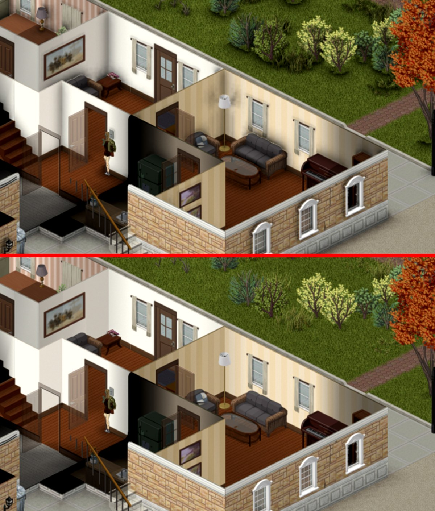
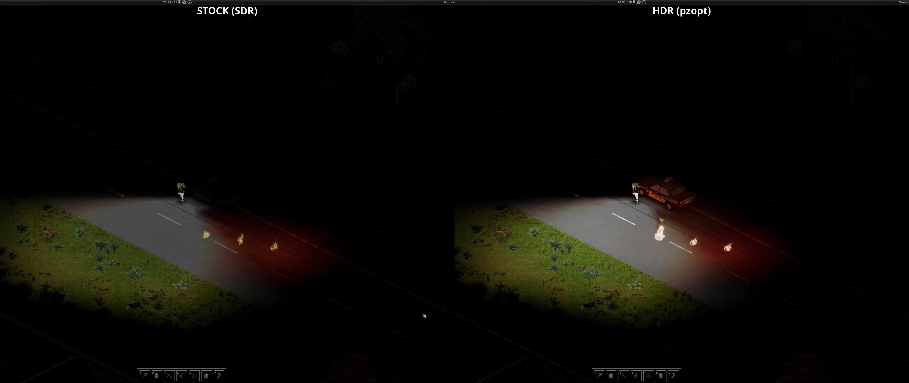

# Modern graphics enhancements that fit this renderer (2026-09-25)

Candidates for further visual features after the ambient-occlusion pass
(`docs/findings-ambient-occlusion-2026-09-24.md`), asked by the maintainer: "surface scattering, tessellation, soft
contact shadows, wind simulation, things that modern games have". Each entry says what the engine gives us, what it
would cost, and how it would ship; ordering is payoff per effort.

**Status (2026-09-26).** Shipped, all off by default on the Enhancements tab: item 1, sun shadows (`sunShadows`,
`docs/findings-contact-shadows-2026-09-25.md`, with the character capsule shadows of candidate D.3); item 2,
per-pixel lighting (`pixelLight`, phases A-C and the experimental torch shadows of D,
`docs/findings-per-pixel-lighting-2026-09-25.md`); item 4, reflections (`reflections`,
`docs/findings-reflections-2026-09-25.md`); candidate B, darkness floor, remembered places and colour grading
(`darknessFloorPct`, `memoryTint`, `colorGrading`, released `ea05422`, `docs/findings-darkness-grading-2026-09-26.md`).
Open: items 3, 5-8 and candidates A, C, D.1-2, E-O.

## What the engine gives us

- Tiles are pre-rendered isometric sprites baked into chunk textures (FBORenderChunk). There is no geometry for the
  world, so anything that needs a mesh (tessellation, displacement) has nothing to work on.
- The FBO depth is an exact world-space height field under an orthographic 2:1 projection (the AO pass's finding:
  `IsoDepthHelper`, 424.27 squares per unit of depth). That is the lever for shadows, normals, reflections and
  light shafts: every one of them is a walk over that height field, at bake time when the result is static.
- Characters, animals and vehicles are low-poly skinned models with normals, lit by the per-square light map.
- Lighting is per square (libLighting64), flat across the square; light sources (lamps, fire, headlights) are known
  to the engine. The HDR pass already expands highlights, adds bloom and glints (`docs/findings-hdr-2026-09-24.md`).
- The climate manager has wind speed and direction, cloud cover, fog, rain and snow; `fogPass` owns a depth-aware
  fog buffer and composite; `puddleVbo` owns the wet squares.
- Two GPU-side seams are already ours: the chunk bake (`FBORenderCell`, where AO multiplies in) and the composite
  (`pzopt.RenderScale` / `pzopt.Upscaler`, where a screen-space pass can run before the resolve).

## Candidates, in order

### 1. Soft directional shadows (the "soft contact shadows" ask)

**Done 2026-09-25** (`sunShadows`, pzopt.SunShadow / pzopt.CapsuleShadow): the sun term in the chunk AO kernel and
capsule shadows for characters and cars, see `docs/findings-contact-shadows-2026-09-25.md`. The text below is the
original plan.

Sun shadows cast by walls, trees, fences, furniture and vehicles, with a penumbra that widens with the distance
between caster and receiver (PCSS-style: blocker search, then a filter radius from the blocker distance).

- How: a ray march along the sun direction through the height field when a chunk texture bakes, the same
  neighbour-depth context the AO uses across chunk edges; the result multiplied into the texture next to the AO term.
  Sun direction from the time of day (the stock day cycle gives the elevation, the azimuth is a fixed choice per
  world since the map has no compass in its light).
- Time of day moves the shadows: a lighting-only re-bake already exists (`lightingRebake*`); the shadow term is
  recomputed on those re-bakes (a few per minute), never per frame.
- Characters: a projected shadow of the model onto the height field instead of the blob ellipse, drawn per frame
  as the shadow ellipse is today (`shadowPrep` already computes the ellipse off-thread).
- Cost: bake-time like AO (~1.25 % of GPU time in the heaviest streaming for AO); near zero on a still scene.
- Ships as a second tick box next to "Ambient occlusion", off by default (a deliberate change of the picture).
- Rig: the AO `--shot-at` comparison, a time-of-day sweep (`time_of_day=` flag) for the shadow direction.

*Visual example.* Factorio's tree shadows as one merged layer over the terrain (left) and RimWorld's sun shadows
lengthening from noon to twilight (right): isometric scenery casting soft directional shadows.

 

Penumbra: hard vs percentage-closer-filtered shadow edges ([learnopengl figure](https://learnopengl.com/img/advanced-lighting/shadow_mapping_soft_shadows.png)); the
widening-with-distance rule is NVIDIA's [PCSS whitepaper](https://developer.download.nvidia.com/shaderlibrary/docs/shadow_PCSS.pdf). In a 3D isometric game:
[Diablo IV, bare trees on snow](https://shared.akamai.steamstatic.com/store_item_assets/steam/apps/2344520/73d3413a15dcde01592a1e8e3c998ec128ef9676/ss_73d3413a15dcde01592a1e8e3c998ec128ef9676.1920x1080.jpg).
In Project Zomboid itself: the [ShadowZ mod](https://steamcommunity.com/sharedfiles/filedetails/?id=3800671550) ([video](https://www.youtube.com/watch?v=ss0VTy-gmrY)),
sprite-silhouette shadows, which is what the height-field march replaces. Sources: [FFF-227](https://factorio.com/blog/post/fff-227),
[RimWorld sun shadows](https://ludeon.com/blog/2013/08/sun-shadows/).

### 2. Per-pixel lighting (light composed per frame instead of baked per square)

**Done 2026-09-25** (`pixelLight`, pzopt.PixelLight): the unlit bake and the per-frame light lattice (phases A-C),
torch / lamp shapes and facing, experimental torch shadows (`pplShadows`, phase D), see
`docs/findings-per-pixel-lighting-2026-09-25.md`. The text below is the original plan.

Today the light map is per square (libLighting64), applied when the chunk texture bakes: a lamp is a stepped
patch of squares, a flickering lamp or a torch that moves with the player re-bakes its chunks
(`lightingRebakeMs`, `lightingRebakeBudget`, the lightning-flash stalls, the `LightDirt` floods), and headlights
sweep in square-sized steps. Per-pixel lighting is the biggest "modern" change available and also a structural
performance win: light stops being a reason to re-bake.

- What the engine gives us: a depth texel plus its screen position is an exact world position (screen x gives
  x - y, screen y gives (x + y) / 2 - z, the depth gives x + y + 2z: three equations, three unknowns; the AO pass
  already works in that space). So the composite knows, per pixel, which square and level it is on, its snapped
  normal, and its distance to every light source. The engine knows every light source (position, radius, colour)
  and the sun.
- Phase A, shape only: keep the stock per-square light as the intensity, blend it across square edges per pixel and
  shape it with the per-pixel distance falloff of the nearest sources (normalised so a square's mean stays what
  libLighting says). Removes the blockiness, cannot leak light through walls because the stock map still gates it,
  no bake changes. Cheap.
- Phase B, normals: multiply a per-pixel `max(0, n . l)` from the height-field normal and each source's direction
  (sun included). East-facing and south-facing walls light differently, wall edges get a rim, rain adds a specular
  lobe (the surface darker and glossier while it rains, drying after).
- Phase C, deferred: the chunk texture bakes unlit (albedo only) and the light is composed per frame from a
  light-map texture (per square per level, written from libLighting's per-square results each pass, one small upload
  per dirty chunk level) sampled at the pixel's world position. Light changes never re-bake a chunk again: flicker,
  torches, headlights, lightning are per-frame and smooth, and the lighting re-bake machinery (budgets, held
  re-bakes, strong marks) goes away. This is where the game-thread and GPU cost of light disappears, not just the
  look.
- Phase D, shadowed dynamic lights: the height field gives, per light, a short march from the pixel toward the light
  (walls are tall depth steps), so headlights and torches cast real shadows and sweep across walls. Lights are
  clustered per screen tile (32x32 px tiles, a light list per tile, the N nearest) so cost is lights on screen x a
  few steps, in a half-resolution light buffer.
- What must stay from the stock map: the per-player "can see" gating (rooms the player has not seen are black), the
  indoor / outdoor ambient split, cutaway (removed walls are not in the height field, so light passes where the
  player sees through, which is what one expects).
- Cost: A and B are a few instructions per pixel in the composite, less than the fog composite. C trades the
  re-bake work for one light-map sample per pixel and small uploads. D is the one to budget: it scales with lights
  on screen (night in Louisville with many lamps); the tile clusters and the half-resolution buffer keep it bounded.
- Risks: the sprites carry painted shading, so directional light on top can double-shade (keep the strength a
  percentage, default modest); the Mac's GL 2.1 context (GLSL 1.20, the AO note) needs a fallback for C and D;
  peers' visual-parity judges compare pictures, so every phase is a tick box, off by default until it is judged.
- Rig: the night bench route with the lamp-heavy Rosewood main street, the storm preset for lightning (frame-time
  tail with the re-bake path removed vs today), the Louisville night preset for the light count.

*Visual example.* Today: a hand torch turning in place at 01:00 lands in per-square steps in every panel of our
blocky-lights capture (the panels differ only in re-bake timing), which is the look phase A removes.

The target: a sprite lit per pixel by a 2D point light (Unity URP, left) and Eastward's lamp posts lighting pixel art with a
smooth falloff (right).

 

Phase B's normal term: [flat vs normal-mapped wall under one light](https://learnopengl.com/img/advanced-lighting/normal_mapping_compare.png). More sprite worlds lit
per pixel: [Songs of Conquest torches on fortress walls](https://shared.akamai.steamstatic.com/store_item_assets/steam/apps/867210/ss_05aa6a23efd2bb4ef348f496836ea99287307763.1920x1080.jpg),
[Graveyard Keeper's dynamic lights and sprite shadows](https://www.gamedeveloper.com/programming/graveyard-keeper-how-the-graphics-effects-are-made).

### 3. Wind on foliage

Trees, bushes and grass sway with the climate manager's wind, with gusts, stronger in storms.

- How: a vertex-shader sway (a phase per sprite from its world position, amplitude from wind speed, bending from
  the sprite's base upward). Standard in every modern engine.
- The catch: trees are baked into the chunk textures (`treesInChunkTexture`, `treeBakePass`), so a static texture
  cannot sway. Options, to measure: (a) a separate tree layer per chunk level (the `TreeBake` pass already draws
  trees last, so it could target its own texture) warped per frame in the composite; (b) per-frame tree draws as
  stock does, only while the wind is above a threshold; (c) sway only the small foliage (grass, bushes) that is
  cheap to draw per frame and leave the trunks still.
- Cost: (a) one extra texture per exterior chunk level plus one warped blit; (b) is the per-frame cost the tree
  pass removed, so the storm scenes pay for it exactly when they are slowest.
- Rig: the storm preset with the tree-heavy spot of issue #5.

*Visual example.* No hotlinkable still shows motion; watch [Procedural Grass in Ghost of Tsushima (GDC)](https://www.youtube.com/watch?v=Ibe1JBF5i5Y)
for wind gusts rolling through vertex-offset grass, and Unreal's [SimpleGrassWind](https://dev.epicgames.com/documentation/en-us/unreal-engine/world-position-offset-material-functions-in-unreal-engine)
for the standard vertex sway.

### 4. Screen-space reflections on water and puddles

**Done 2026-09-26** (`reflections`, pzopt.Ssr): pixel-projected reflections fused into the chunk composite, see
`docs/findings-reflections-2026-09-25.md`; what is left: `docs/plan-reflections-followup.md`. The text below is the
original plan.

The scene mirrored into rivers, lakes and puddles, on top of the HDR glints.

- How: water is a flat plane at a known height; in an isometric view a reflection is the baked texture sampled
  mirrored about the shoreline along the view's vertical, faded by distance, broken up by the water's own normal
  animation. Puddles reuse the same lookup through `puddleVbo`'s squares.
- Cost: one texture read per water pixel in the water shader; the puddle shaders are already ours.
- Rig: the Riverside pier spot (`start=6445,5195`) at dawn and at night with lamps.

*Visual example.* Screen-space reflections following a car over a wet floor (Unity HDRP, left) and rain puddles reflecting a
street (Lagarde, right).

 

Top-down water with reflections: [Anno 1800 harbour](https://shared.akamai.steamstatic.com/store_item_assets/steam/apps/916440/ss_9756553b540fbfefc2d96baafc33aecd7ef1dc44.1920x1080.jpg),
[Triangle Strategy (HD-2D) river beside pixel sprites](https://shared.akamai.steamstatic.com/store_item_assets/steam/apps/1850510/ss_462d6307727e2391acf87f028dab8fb8c50eed07.1920x1080.jpg).

### 5. Light shafts (god rays) through windows and canopies

Sun shafts in dusty interiors and under trees, lamp cones in fog.

- How: the fog pass already has a depth-aware fog buffer at 25 % resolution; a shaft is a radial march from the
  light's screen position through that buffer, masked by the height field (windows and tree gaps let light
  through, walls block it). Lamps and headlights use the same march from their known positions.
- Cost: bounded by the fog buffer size; one march per light on screen.
- Ships under the fog tick box's family, strength as a percentage like `hdrBloomPct`.

*Visual example.* Beams through a ruin's windows (Rise of the Tomb Raider, left) and HD-2D sun haze over pixel sprites
(Octopath Traveler II, right).

 

The real thing for reference: [crepuscular rays](https://en.wikipedia.org/wiki/Crepuscular_rays).

### 6. Cloud shadows

Soft cloud shadows drifting across the ground with the wind.

- How: two scrolling noise octaves multiplied into the outdoor squares in the composite, strength from the cloud
  cover and the sun height, direction and speed from the wind. No engine data beyond what the climate manager has.
- Cost: negligible. Very high mood per line of code. Check first that stock B42 has nothing similar.

*Visual example.* Sea of Stars' cloud sprites shading the pixel-art overworld:

Unreal's [Volumetric Cloud "Cloud Shadows" section](https://dev.epicgames.com/documentation/en-us/unreal-engine/volumetric-cloud-component-in-unreal-engine) has the same landscape with the shadows off and on.

### 7. Anti-aliasing and depth of field

- SMAA or a small TAA on the composite for players who do not run DLSS (FSR 1.0 and bicubic upscale do not
  anti-alias). Sprite edges and model edges are where the game looks dated at 4K.
- Optional tilt-shift depth of field from the depth buffer, a "miniature" look; cheap, contentious, off by default.

*Visual example.* A jagged vs anti-aliased edge (left) and Octopath Traveler's tilt-shift band, sharp centre, blurred top and
bottom, on a pixel-art graveyard (right).

 

The miniature effect on a photograph: [Jodhpur tilt-shift](https://upload.wikimedia.org/wikipedia/commons/thumb/c/cf/Jodhpur_tilt_shift.jpg/960px-Jodhpur_tilt_shift.jpg) vs
[the original](https://upload.wikimedia.org/wikipedia/commons/thumb/a/ae/Jodhpur_rooftops.jpg/960px-Jodhpur_rooftops.jpg). AA modes side by side: Unreal's
[anti-aliasing page](https://dev.epicgames.com/documentation/en-us/unreal-engine/anti-aliasing-and-upscaling-in-unreal-engine) (FXAA / TAA / MSAA sliders).

### 8. Smaller ones

- Wet and snowy material response: darken plus specular while raining, a snow tint on the up-facing normal in
  snowfall (stock swaps snow tiles; this would blend the transition).
- Eye adaptation between dark interiors and daylight (HDR options list item 11).
- Foliage interaction (grass pushed by characters and vehicles): decals into the baked texture, restored on the
  next re-bake; only worth it together with 3.

*Visual example.* Dry to wet material response (Lagarde: albedo darkens, gloss rises, left) and snow piled on stone steps
(Rise of the Tomb Raider, right).

 

Eye adaptation: Unreal's [auto exposure page](https://dev.epicgames.com/documentation/en-us/unreal-engine/auto-exposure-in-unreal-engine), the underpass pair with local exposure off and on.
Grass displaced by the player: the [Ghost of Tsushima grass talk](https://www.youtube.com/watch?v=Ibe1JBF5i5Y).

## What does not map

- Tessellation and displacement need geometry to subdivide. Tiles have none; the character models are too low-poly
  and too small on screen for it to show.
- Subsurface scattering applies to skin and leaves. The only skin on screen is on models a few dozen pixels tall at
  play zoom; a wrap-lighting term on the model shader would give the visible part of it for free if ever wanted.
- Ray tracing: nothing to trace against; the height-field marches above are the isometric equivalent.

## Suggested first step

Items 1 and 2A/2B are the first pair: both are one term in a pass we already own. Item 2C is the one worth a
proper plan of its own, since it removes the lighting re-bakes from the game thread as well as changing the look.

Item 1 reuses most of `pzopt.ChunkAo` (the bake hook, the neighbour depth context, the kept term across
lighting-only re-bakes) and lands as one more tick box. Measure it the way AO was measured: `devAoTiming`-style
route cost, the capped 120 km/h drive's frame-time tail against off, and a shot comparison for the picture.

## Second pass: deep research (2026-09-25)

Three research sweeps behind this section: techniques from pre-rendered / 2.5D / sprite games (Pillars of Eternity,
Disco Elysium, Dead Cells, Graveyard Keeper, Songs of Conquest, Factorio, RimWorld, Octopath, The Last Night, Space
Marine's decals, Remember Me's wet surfaces), the 2018-2026 real-time rendering catalogue judged against this
renderer, and what Project Zomboid players, modders and The Indie Stone say (Thursdoids 2022-2026, the 42.x
changelogs, Steam / TIS forum threads, Workshop subscriber counts). Costs below are GPU at 4K on the 4090 class,
"negl" < 0.1 ms, "light" 0.1-0.5, "mod" 0.5-2, "heavy" > 2; estimates unless a source gives the number.

### What players actually ask for (ranked by how often it comes up)

1. **Interiors and nights are "the void"**: black rooms by day, pitch-black post-power looting, still the loudest
   complaint after 42.20's "darker, blacker" pass (Steam "Build 42 Lighting - Too Dark", TIS 75051). Wish: a floor
   under the darkness, a light bubble, pitch black only in basements. Light mods total > 240k subscribers.
2. **B42 looks blurry / forced AA**, worse zoomed out and driving (Steam "Game Overall Looks Blurry?", 103 replies,
   devs answered with a debug filter; 42.9 added the Screen Filter option). ShaderZ, which strips the blur, has 30k
   current / 100k lifetime subscribers.
3. **Rooms outside the view cone go black** instead of a dim "remembered" rendering (89-reply thread, polarising,
   "still tweaking it" from a moderator). Wish: greyscale memory and soft transitions instead of black.
4. **Flat look, no directional shadows, light in per-tile steps** (TIS 6826 / 14091 / 94063, 2013 → Apr 2026, no
   staff reply). ShadowZ, a classpath jar that projects sun shadows from sprite silhouettes and mesh shadows for
   characters, took 10k subscribers in 12 days (2026-09): demand is proven and a Java patch is accepted by players.
5. **Headlights and flashlights too weak** for the new darkness (49-reply thread; partly addressed 42.9-42.15).
6. **4K / ultrawide**: soft image, too little zoom range (zoom mods > 100k subscribers).
7. **Colour and night tint** regressed vs B41 (Blue Moon night colour correction: 90k subscribers).
8. Fog too dense / wants tint (occasional), cutaway glitches and "outline zombies behind buildings" (occasional),
   in-game AA / bloom / DoF / grading (occasional, served by ReShade presets that lose depth on B42 anyway).

TIS's stated 2026 plan is a "B42 Support Update" (optimization, modding support, polish) and then B43 = NPCs; no
renderer feature is announced. Items 1-7 above are the market for this plan. Notably 1, 3, 5 and 7 are not
"techniques" but looks: they need a policy knob (a darkness floor, a memory tint, a cone length, a night LUT) more
than a new pass, and they are the cheapest wins on the list.

### Already stock, do not re-propose

Light propagation with coloured sources and colour temperatures, chunk-texture caching with baked depth, per-tile
depth textures (grass through the character, 3D items on shelves), the visibility polygon with its opacity slider,
curtain / barricade light filtering (42.13 tile properties `LightFilter*`), the nearest / linear screen filter,
skybox reflections in vehicle windows (B40, `perfSkybox`, `bPerfReflections`), puddle and fog quality tiers,
corpse blob shadows, snow overlays (static tiles, no accumulation), ragdolls, search-mode blur (the only stock
post-process).

### New candidates

Ordered by (player demand x fit x 1 / cost). Each says what it needs, what it costs, and where it hooks.

**A. Sprite filtering that ends the blur (demand #2, #6).** Magnified (zoomed in): texel-aware anti-aliased point
sampling (a hard texel edge smoothed over exactly one screen pixel) keeps sprite edges crisp without shimmer;
minified (zoomed out, driving): shader-supersampled mips instead of trilinear for high-contrast tile art. One
sampler change in the chunk composite and the per-frame sprite path, plus an Optimizations-tab combo (nearest /
stock linear / texel-aware). Cost negl. Same place as an in-game SMAA toggle (item 7). Sources: d7samurai's
"antialiased point sampling" gist; Golus, "Sharper mipmapping using shader-based supersampling".

*Visual example.* The same sprite under plain nearest sampling vs texel-aware "antialiased point" sampling while it moves by
fractions of a pixel (d7samurai, left: the nearest version crawls and shimmers) and nearest vs linear magnification (right).

 

More: [Cole Cecil, scaling pixel art without destroying it](https://colececil.dev/blog/2017/scaling-pixel-art-without-destroying-it/) (distorted / good / blurry),
[a live demo of shader-supersampled mips](https://gnikoloff.github.io/webgl-mipmaps-explainer/) for the zoomed-out case, the [gist itself](https://gist.github.com/d7samurai/9f17966ba6130a75d1bfb0f1894ed377).

**B. Darkness floor, memory tint, night LUT (demand #1, #3, #7).** **Done 2026-09-26** (`darknessFloorPct`,
`memoryTint`, `colorGrading`; pzopt.Darkness / pzopt.Grade): see `docs/findings-darkness-grading-2026-09-26.md` —
the floor on the native's per-square light (no frame cost), the remembered look in place of the stock vision pass
(no cost), and the grade fused with the stock composite's tail in one 65³ LUT (~37 us a frame *cheaper* than stock at
5K). The text below is the original plan. Three knobs in the composite, none needing new
data: (1) a minimum world luminance for seen squares (a sandbox-style "darkness floor", basements exempt), (2)
squares the player has seen but cannot see now drawn desaturated and dimmed with a soft edge instead of the hard
black (the stock "can see" gate already knows which), (3) LUT colour grading per time of day and weather, a few 3D
LUTs blended (Graveyard Keeper: 10 LUTs by time and zone; Factorio FFF-320: night as a desaturating, cooling LUT
instead of a black overlay, and a LUT tool for modders). Grade in scene-linear before the HDR mapping. Cost negl.
(1) and (2) change what the player can make out, so they are opt-in and off in the parity comparisons.

*Visual example.* Factorio's night as a black overlay (left) vs as a colour LUT (right): hue and contrast survive the dark.

 

Memory rendering: seen-but-not-visible terrain under a grey shroud, unexplored black ([Freeciv](https://upload.wikimedia.org/wikipedia/commons/e/ee/Freeciv-net-screenshot-2011-06-23.png)), the
convention the "remembered room" tint borrows. Graveyard Keeper's ten time-of-day LUTs and the same spot through the day are in
[its graphics article](https://www.gamedeveloper.com/programming/graveyard-keeper-how-the-graphics-effects-are-made). Source: [FFF-320](https://factorio.com/blog/post/fff-320).

**C. Dynamic resolution scaling driven by the GPU timer (the objective's own feature).** The upscaler already takes
any input size (FSR1 / DLSS / bicubic) and `gpuSections` already has the GL timer queries: a controller that lowers
the render scale when GPU frame time exceeds the cap's budget and raises it back is the one tool that turns "GPU
bound in a 4K storm" into a held 240 with the GPU saturated. Cost: the controller only. Source: Binks, "Dynamic
resolution rendering" (Intel, 2011).

*Visual example.* Unreal's [dynamic resolution page](https://dev.epicgames.com/documentation/en-us/unreal-engine/dynamic-resolution-in-unreal-engine): the
"cruising" graph (screen percentage tracking GPU frame time inside the budget), the "over budget panic" drop, and the 100 % vs
50 % viewport pair. That controller shape, driven by our GL timer queries, is the whole feature.

**D. Characters that sit in the world (demand #4, the "pasted on" look).** Three cheap terms on the model shader:
(1) a Valve-style ambient cube per character from the 3x3 squares around it (sides from the neighbours, top from the
sky term) instead of one flat square value, which also stops zombies popping between squares; (2) the blurred
chunk composite under the character as its ambient colour (Pillars of Eternity: "subtle green in a jungle"); (3)
capsule shadows against the sun for the on-screen list (`ShadowPrep`'s ellipse is the isotropic case: the capsule
stretches with sun elevation and works in indirect light), and on the receiving side the models written into the
height field so item 1's march casts them onto walls for free. Cost light for ~1k zombies. Sources: Valve
SIGGRAPH 2006 course; PoE update 79; UE capsule shadows.

*Visual example.* Pillars of Eternity [update 79](https://eternity.obsidian.net/eternity/news/update--79-graphics-and-rendering-): the character-ambient
off / on pair (the model takes the background's colour) and the shadow-blending pair; [video](https://www.youtube.com/watch?v=ak52BLOFyuo). Capsule shadows:
Unreal's [overview](https://dev.epicgames.com/documentation/en-us/unreal-engine/capsule-shadows-overview-in-unreal-engine), "Capsule Indirect Shadow Enabled / Disabled",
the soft grounding shadow under a skeletal mesh. The ambient cube figure is in Valve's
[Source shading course](https://cdn.cloudflare.steamstatic.com/apps/valve/2006/SIGGRAPH06_Course_ShadingInValvesSourceEngine.pdf).

**E. Local-light contact shadows and height-aware falloff (demand #4, #5).** Bend Studio's screen-space shadows
run the item-1 march for the N nearest strong lights (headlights, fire, lamps) with a short ray, in their
wavefront-aligned layout (each thread group walks one light-aligned pixel line, coalesced depth reads; code and
SIGGRAPH 2023 slides public); Graveyard Keeper's rule of fading light a sprite could not reach by comparing light
height with pixel height is a one-liner once the composite knows the height. Together they make headlights sweep
walls and lamps cast furniture shadows, the two things the light-mod crowd installs mods for. Cost light per sun,
mod for many lights (budget the N). This is item 2D made concrete.

*Visual example.* Unreal's [contact shadows page](https://dev.epicgames.com/documentation/en-us/unreal-engine/contact-shadows-in-unreal-engine): the character
without / with a 0.1 contact-shadow length (the small shadows a shadow map misses appear where the feet meet the ground), plus the
parallax-occlusion GIF. Days Gone's own: a [19 s clip](https://www.youtube.com/watch?v=SLTrPWTj-Ss); slides and code at
[Inside Bend: screen space shadows](https://www.bendstudio.com/blog/inside-bend-screen-space-shadows/).

**F. Screen-space decals on the height field.** Blood, tyre tracks, footprints, ash, snow patches as thin boxes
projected onto the exact height field (Space Marine, SIGGRAPH 2012: reconstruct position from depth, reject outside
the box or where the derived normal disagrees, stencil out moving objects) instead of extra sprites; static ones
baked into the chunk texture through the existing re-bake path, transient ones per frame. They wrap onto walls
correctly because the height field is exact. Cost light dynamic, negl baked.

*Visual example.* The same scene without and with projected decals (Unity URP): they wrap over uneven geometry and hide seams.

 

Space Marine's original slides: [Screen space decals in Warhammer 40,000: Space Marine](https://www.slideshare.net/blindrenderer/screen-space-decals-in-warhammer-40000-space-marine-14699854).

**G. One world-aligned "surface state" texture: snow tracks, rain ripples, wetness.** Under a fixed orthographic
camera a top-down texture around the camera is exactly the view, so three published mechanisms collapse into one
buffer: Rise of the Tomb Raider's deferred snow deformation (an R8 height map stamped by feet and tyres, refilling
over time), Müller's 2D height-field wave solver for rain and footstep ripples on water and puddles, and a per-chunk
wetness scalar integrated on the CPU (rain, sun, wind, temperature, roof cover: porous tiles dry slower, under a
roof stays dry, puddles recede), driving Lagarde's wet-surface response (albedo darkened by porosity, gloss up,
flat normals at "puddle"). Cost light. This subsumes the "wet and snowy material response" and "foliage
interaction" lines of item 8.

*Visual example.* Wetting levels by porosity (Lagarde, left: porosity 0 → 1, then textured porosity) and a wet surface drying over
time (right, specular-only row).

 

Snow trails: [Rise of the Tomb Raider deferred snow deformation](https://www.youtube.com/watch?v=2esjGj81q2k). Ripples: Müller's
[height-field water](https://matthias-research.github.io/pages/publications/hfFluid.pdf) (GDC 2008).

**H. Height-field GPU particles with exact collision.** Leaves, ash, snow, dust motes, fireflies, sparks driven by
the wind vector, colliding against the height field, which here is a true height map (UE's scene-depth collision
fails off-screen and at grazing angles; an orthographic height field has neither problem). Cost light. Pairs with
item 3 (wind).

*Visual example.* GPU particles resting on geometry read from the depth buffer (Unity VFX Graph "Collide with Depth Buffer"):

Unreal's version: [GPU particles with scene depth collision](https://dev.epicgames.com/documentation/en-us/unreal-engine/1.5---gpu-particles-with-scene-depth-collision?application_version=4.27).

**I. Froxel fog lit by local lights.** Wronski's volumetric fog (SIGGRAPH 2014, 1.1 ms at 160x90x64 on a PS4,
resolution independent): under the orthographic camera the froxel grid is a world-aligned box, light injection uses
the per-square light plus item 1's march for shadowing, temporal reprojection is trivial because the grid is
world-fixed. Fog lit by street lamps and headlights, shadowed shafts: the visible step past the current fog pass and
the proper form of item 5. Cost mod; off on the iGPU tier.

*Visual example.* Today's fog pass on the 120 km/h storm drive, stock (left) vs ours (right), unlit fog either way:

The target: Unreal's [volumetric fog page](https://dev.epicgames.com/documentation/en-us/unreal-engine/volumetric-fog-in-unreal-engine), a spot light's cone made visible in
froxel fog next to the same scene with its scattering off, and shadowed fog through an arch. The method: Wronski's
[Assassin's Creed 4 talk](https://bartwronski.com/wp-content/uploads/2014/08/bwronski_volumetric_fog_siggraph2014.pdf).

**J. Indirect light: multi-bounce and bent normals on the existing AO, then SSGI.** Jimenez's GTAO multi-bounce is a
cubic fit of GI vs AO per albedo evaluated in the AO resolve, and the bent normal is a by-product of the horizon
search; both are negl on top of `ChunkAo`. One-bounce screen-space GI (lit walls bleeding onto floors, lamp light
spilling round corners) at half resolution with temporal reuse is the next step, mod cost, needs the TAA of item 7.
Sources: Jimenez et al. 2016; XeGTAO (MIT); Ritschel 2009 SSDO.

*Visual example.* Our AO today (on, top; off, bottom; Rosewood, zoom 1), the term the multi-bounce and bent normals extend:

One-bounce colour bleeding from screen-space traces (Unity HDRP SSGI):

Multi-bounce and bent-normal figures: the [GTAO paper](https://www.activision.com/cdn/research/Practical_Real_Time_Strategies_for_Accurate_Indirect_Occlusion_NEW%20VERSION_COLOR.pdf).

**K. Water details.** Gerstner sum of 3-4 waves in the water tile shader, caustics from (water level - height) with
an animated texture, foam by distance to shore (from tile adjacency), refraction by UV perturbation of the offscreen
buffer, ripples from G. All negl to light; FFT oceans and planar reflections are not worth it top-down.

*Visual example.* Gerstner wave crests (GPU Gems fig. 1-5, left) and projected caustics (fig. 2-9, right).

 

Real caustics for reference: [pool caustics](https://upload.wikimedia.org/wikipedia/commons/2/2a/Caustics.gif); refraction of a water surface:
[GPU Gems 2 fig. 19-6](https://developer.download.nvidia.com/books/gpugems2/19_refraction_06a.jpg); foam and shorelines: [Water rendering in Far Cry 5](https://www.gdcvault.com/play/1025330/Water-Rendering-in-Far-Cry).

**L. Small composite effects.** Heat haze above fire and exhausts (UV perturbation, depth-tested); the lightning
flash as a directional flash from the strike point through the height-field march instead of a uniform brighten;
triangular-noise dithering before every quantisation (night fog and bloom band on 8-bit, and on the 10-bit PQ path
too; Playdead's INSIDE slides); AgX / Khronos PBR Neutral as SDR tone-map choices next to the HDR path; lens flares
only from local lights (the sun is never in frame); low-health vignette and desaturation; camera shake and hit stop
are game-side. Motion blur is off at 240 Hz (display persistence already blurs), per-object blur for the 120 km/h
car is the only defensible use.

*Visual example.* Banding vs dithering at 16 colours (left pair) and a lens flare from a local light (Unity HDRP, right).

  

Heat haze is the same UV perturbation as [screen-space refraction](https://developer.download.nvidia.com/books/gpugems2/19_refraction_06a.jpg). Tone mappers: Blender 4.0's
[Filmic vs AgX pair](https://developer.blender.org/docs/release_notes/4.0/color_management/); Playdead's [INSIDE rendering slides](https://github.com/playdeadgames/publications/blob/master/INSIDE/rendering_inside_gdc2016.pdf) for the dithering recipe.

**M. Outline / x-ray for zombies behind walls, dithered cutaways (demand #8).** Walls have exact per-pixel depth, so
a depth-greater pass on the character models is enough for a silhouette; screen-door dithering under TAA converges
to real translucency and could replace the hard cutaway pops. Shows what stock hides, so opt-in and out of parity.

*Visual example.* Silhouettes through occluders (The Last of Us enemy outline) and comic outlines in Alexander Ameye's
[outline survey](https://ameye.dev/notes/rendering-outlines/); screen-door dither instead of a pop in Cesium's
[smoother LOD transitions](https://cesium.com/blog/2022/10/20/smoother-lod-transitions-in-cesium-for-unreal/) (Fig 1.0 vs 2.0 GIFs).

**N. Emissive tiles as light sources.** Lit windows, signs and screens as small entries in the existing light list.
Needs a hand list of emissive tile IDs (a luma threshold on the art misfires on bright paint). Negl.

*Visual example.* Our emitters today: stock (left) vs the HDR pass (right) at night, headlights and fires pushed to the panel's
peak but lighting nothing around them; N would let the lit windows and signs feed the light list.

The target look: [The Last Night](https://shared.fastly.steamstatic.com/store_item_assets/steam/apps/612400/805b1875126a2c5ab513b8aa97a2a82658d0dcfe/ss_805b1875126a2c5ab513b8aa97a2a82658d0dcfe.1920x1080.jpg),
pixel-art neon and windows lighting a wet street; Lumen's [emissive materials figure](https://dev.epicgames.com/documentation/en-us/unreal-engine/lumen-global-illumination-and-reflections-in-unreal-engine).

**O. Material classes for the tile set, offline.** For wet, specular and micro-relief to look right the composite
needs porosity / roughness per tile and micro-normals for floors. RTX Remix / PBRFusion-style generation over the
tile atlas gives a first pass (NVIDIA reports ~80 % workflow saving and hand validation for roughness, metal,
glass); the 2022 survey of pixel-art normal generation says colour-Sobel is acceptable for texture-like sprites
(grass, asphalt, wood) and wrong for objects, where the depth-derived normal is the right one. So: Sobel
micro-normals for floors, depth normals for everything else, a hand table for glass, metal, water, emissive. A
tooling task, not a runtime feature; unblocks G's porosity and item 2B's specular.

*Visual example.* A flat sprite and the normal map Laigter generates from it:

 

Tools and papers: [Laigter](https://github.com/azagaya/laigter), [Sprite Lamp](https://www.snakehillgames.com/spritelamp/), the
[pixel-art normal generation survey](https://arxiv.org/abs/2212.09692), NVIDIA's [Painkiller RTX write-up](https://developer.nvidia.com/blog/how-painkiller-rtx-uses-generative-ai-to-modernize-game-assets-at-scale/).

### Pitfalls the research turned up

- **Double shading.** The sprites carry painted shadows and shading. Pillars of Eternity masked its dynamic shadows
  with a "sun contribution" map and tinted them to the art's shadow hue; Factorio split shadows out of its sprites
  (FFF-42). Item 1's march needs a per-tile "art already has a shadow here" heuristic or a modest strength, or
  shadows stack.
- **Depth is what makes this possible and what ReShade never gets.** B42 ReShade presets tell users to disable the
  depth add-on, so MXAO / DoF are unavailable to them; everything here runs inside the game with the real depth.
- **Toggles must not change what a player can see** in the parity comparisons (D2R's rule: the legacy toggle
  changes the picture, never the information). B, M and the darkness knobs are opt-in for that reason.
- **Mac GL 2.1** (GLSL 1.20) for everything with integer ops or MRT; the fog pass and AO already switch themselves
  off there; the flip's Radeon 890M (Mesa, GL 4.6) is the iGPU tier to budget I and J against.

### Skip, with reasons

- Frame generation (DLSS 3 / FSR 3 / Lossless Scaling): holds at least one real frame before display, so at a
  120 → 240 conversion the added latency is of the order of the gain, it violates "CPU and GPU used to the max",
  and neither Streamline nor FSR 3 has an OpenGL path. A user-side option at most.
- Cascaded shadow maps (fight perspective aliasing; an orthographic camera has none), planar reflections (SSR is
  right top-down), sky / moon / aurora rendering (the sky is never in frame; it is a lighting input only), ML sprite
  super-resolution (hallucinates on hand-drawn iso art and ships TIS's assets), variable rate shading (NVIDIA-only
  in GL, the full-screen passes are already ~0.5 ms), authored per-sprite normal maps (thousands of tiles; O covers
  what can be generated), texture-space shading (the chunk bake already is one).

### Revised order

Cheap looks first, then the passes that reuse the height-field march, then the volumetrics:

1. A (sprite filtering) + B (darkness floor, memory tint, LUT) + C (dynamic resolution): three negl-cost items that
   answer the top three player complaints and the objective.
2. Item 1 (sun shadows) with E (local-light contact shadows) and D (characters seated in the world): the demand
   ShadowZ proved, done with the exact height field instead of sprite silhouettes.
3. Item 2 (per-pixel lighting) phases A-C, with J's bent normals folded into the AO resolve.
4. G (surface state texture) + F (decals) + H (particles): one world-aligned mechanism, three visible results.
5. I (froxel fog) and J's SSGI, budgeted per GPU tier.
6. K, L, M, N as fillers; O as the offline tooling that unlocks the material side.

### Sources

Pillars of Eternity update 79 (graphics and rendering); Factorio FFF-42, FFF-320; Graveyard Keeper graphics
article (gamedeveloper.com); Songs of Conquest (80.lv); Dead Cells 3D pipeline (gamedeveloper.com); Space Marine
screen-space decals (SIGGRAPH 2012); Lagarde, "Water drop 3b: physically based wet surfaces"; Bend Studio, "Inside
Bend: screen space shadows"; Fernando, PCSS 2005; Valve, "Shading in Valve's Source engine" (SIGGRAPH 2006); UE
capsule shadows; Wronski, "Volumetric fog" (SIGGRAPH 2014); Michels & Sikachev, "Deferred snow deformation in Rise
of the Tomb Raider" (GPU Pro 7); Müller-Fischer, GDC 2008 height-field water; Jimenez et al., "Practical realtime
strategies for accurate indirect occlusion" (2016); XeGTAO; Ritschel et al. 2009 SSDO; Binks, dynamic resolution
rendering (Intel 2011); d7samurai antialiased point sampling; Golus, shader-based supersampled mips; Playdead,
"Banding in games"; Khronos PBR Neutral; NVIDIA, "How Painkiller RTX uses generative AI to modernize game assets";
Moreira et al. 2022, pixel-art normal generation survey; Ladavac, "The elusive frame timing" (GDC 2018); Steam
discussions 595136892797787238, 595135660380149846, 596286923596864092, 523083364935150839; TIS forum topics
75051, 74519, 72917, 94063; Workshop items 3800671550 (ShadowZ), 3419026942 (ShaderZ), 3616381828 (Blue Moon).
